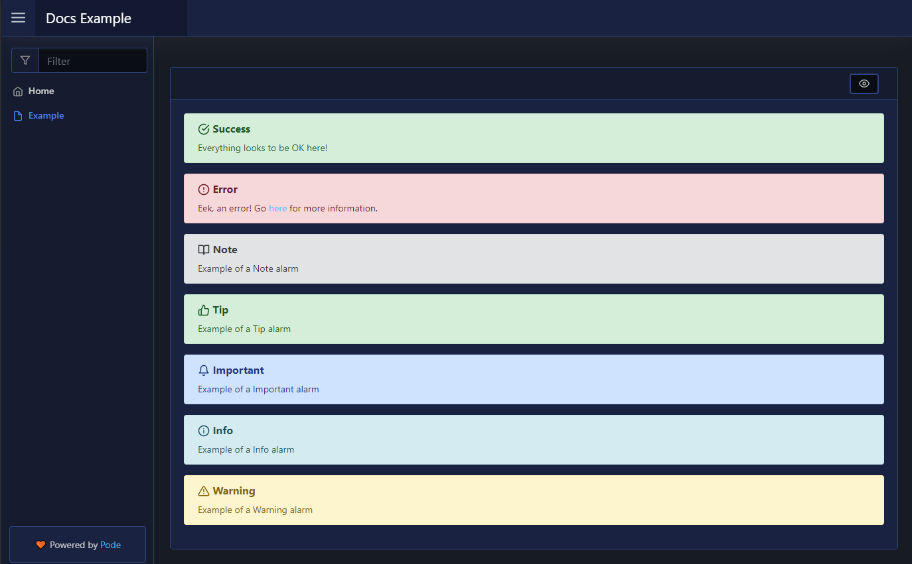

# Alert

| Support | |
| ------- |-|
| Events | No |

An alert is a colour block containing information text; alerts can for warning, errors, tips, etcs. To add an alert you use [`New-PodeWebAlert`](../../../Functions/Elements/New-PodeWebAlert), and supply either a `-Value` or `-Content`:

```powershell
New-PodeWebCard -Content @(
    New-PodeWebAlert -Value 'Everything looks to be OK here!' -Type Success
    New-PodeWebAlert -Type Error -Content @(
        New-PodeWebText -Value 'Eek, an error! Go'
        New-PodeWebLink -Value 'here' -Source 'https://google.com'
        New-PodeWebText -Value 'for more information.'
    )
    New-PodeWebAlert -Value 'Example of a Note alarm' -Type Note
    New-PodeWebAlert -Value 'Example of a Tip alarm' -Type Tip
    New-PodeWebAlert -Value 'Example of a Important alarm' -Type Important
    New-PodeWebAlert -Value 'Example of a Info alarm' -Type Info
    New-PodeWebAlert -Value 'Example of a Warning alarm' -Type Warning
)
```

Which looks like below:


