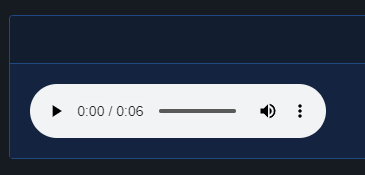

# Audio

| Support | |
| ------- |-|
| Events | Yes |

To play audio clips on your site you can use [`New-PodeWebAudio`](../../../Functions/Elements/New-PodeWebAudio). The audio can be set to auto-play and loop, and can also accept multiple sources and tracks.

The sources specified can be done so via `-Source` and [`New-PodeWebAudioSource`](../../../Functions/Elements/New-PodeWebAudioSource). Sources can only be of type `MP3`, `OGG` and `WAV`, and at least one source must be specified:

```powershell
New-PodeWebCard -Content @(
    New-PodeWebAudio -Name 'example' -Source @(
        New-PodeWebAudioSource -Url 'https://samplelib.com/lib/preview/mp3/sample-6s.mp3'
    )
)
```

Which looks like below:



Any optional tracks you wish to specify can be done via `-Track` and [`New-PodeWebMediaTrack`](../../../Functions/Elements/New-PodeWebMediaTrack). Tracks can only be of type `VTT`, and can be used for subtitles, captions, metadata, etc.

The `-Language` is mandatory if the track's `-Type` is subtitles, and should be a [2-letter language code](https://www.w3schools.com/tags/ref_language_codes.asp).

```powershell
New-PodeWebCard -Content @(
    New-PodeWebAudio -Name 'example' -Source @(
        New-PodeWebAudioSource -Url 'https://samplelib.com/lib/preview/mp3/sample-6s.mp3'
    ) `
    -Tracks @(
        New-PodeWebMediaSource -Url '/some/url/path/english.vtt' -Language 'en' -Title 'English' -Type 'subtitles' -Default
    )
)
```

## Events

The following specific events are supported by the Audio element, and can be registered via [`Register-PodeWebMediaEvent`](../../../Functions/Events/Register-PodeWebMediaEvent):

| Name | Description |
| ---- | ----------- |
| CanPlay | Fires when the browser is ready to play the audio |
| Ended | Fires when the audio has finished playing, unless looping |
| Pause | Fires when the audio is paused |
| Play | Fires when the audio is played, or un-paused |

Example:

```powershell
New-PodeWebAudio -Name 'example' -Source @(
    New-PodeWebAudioSource -Id 'sample' -Url 'https://samplelib.com/lib/preview/mp3/sample-6s.mp3'
) |
Register-PodeWebMediaEvent -Type Play -ScriptBlock {
    Show-PodeWebToast -Title 'Action' -Message $EventType
}
```
