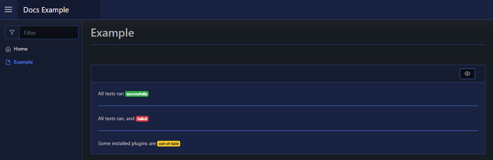

# Badge

| Support | |
| ------- |-|
| Events | Yes |

A Badge is just normal text, but has a styled/coloured background. You can add a badge to your page using [`New-PodeWebBadge`](../../../Functions/Elements/New-PodeWebBadge):

```powershell
New-PodeWebCard -Content @(
    New-PodeWebText -Value 'All tests ran'
    New-PodeWebBadge -Value 'successfully' -Colour Green
    New-PodeWebLine
    New-PodeWebText -Value 'All tests ran, and'
    New-PodeWebBadge -Value 'failed' -Colour Red
    New-PodeWebLine
    New-PodeWebText -Value 'Some installed plugins are'
    New-PodeWebBadge -Value 'out-of-date' -Colour Yellow
)
```

Which looks like below:


