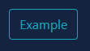

# Button

| Support |     |
| ------- | --- |
| Events  | No  |

To display a button on your page you use [`New-PodeWebButton`](../../../Functions/Elements/New-PodeWebButton); a button can either be dynamic and run custom logic via a `-ScriptBlock`, or it can redirect a user to a `-Url`.

## Dynamic

A dynamic button takes a custom `-ScriptBlock`, and when clicked will invoke that logic. You can run whatever you like, including actions for Pode.Web to action against.

When using a dynamic button you can also supply a `-DataValue`, which is a way of supplying a special value/identity when the button is clicked. If supplied, this value is available in your scriptblock via `$WebEvent.Data['Value']`.

For example, the below button, when clicked, will display a toast message on the page:

```powershell
New-PodeWebCard -Content @(
    New-PodeWebButton -Name 'Click Me' -DataValue 'Random' -ScriptBlock {
        Show-PodeWebToast -Message "This came from a button, with a data value of '$($WebEvent.Data['Value'])'!"
    }
)
```

Which looks like below:


You can pass values to the scriptblock by using the `-ArgumentList` parameter. This accepts an array of values/objects, and they are supplied as parameters to the scriptblock:

```powershell
New-PodeWebButton -Name 'Click Me' -ArgumentList 'Value1', 2, $false -ScriptBlock {
    param($value1, $value2, $value3)

    # $value1 = 'Value1'
    # $value2 = 2
    # $value3 = $false
}
```

### Display/Click Name

For dynamic buttons, alongside `-DisplayName` to customise the rendered value, there is also a `-ClickName` parameter. This `-ClickName` parameter will be shown when the button is clicked, and for the duration in which the spinner is visible. Once the button's action has been completed, the original value is shown again - this will be either `-Name` or `-DisplayName`.

For example, the following will display "Disable Link" originally but when clicked will show "Disabling..." for 2 seconds, and will then revert to "Disable Link" again.

```powershell
New-PodeWebButton -Name 'Disable Link' -ClickName 'Disabling...' -ScriptBlock {
    Start-Sleep -Seconds 2
    Disable-PodeWebLink -Id 'link'
}
```

## URL

To have a button that simply redirects to another URL, all you have to do is supply `-Url`:

```powershell
New-PodeWebCard -Content @(
    New-PodeWebButton -Name 'Repository' -Icon Link -Url 'https://github.com/Badgerati/Pode.Web'
)
```

### New Tab

To open the URL in a new tab, supply the `-NewTab` switch:

```powershell
New-PodeWebButton -Name 'Repository' -Icon Link -Url 'https://github.com/Badgerati/Pode.Web' -NewTab
```

## Outlined

By default, a button will be displayed as a block colour, but you can show a button as an outline by using the `-Outline` switch:

```powershell
New-PodeWebButton -Name 'Example' -Colour Cyan -Outline -ScriptBlock {
    # logic
}
```

Which looks like below:



## Grouping

You can group a series of Buttons by using a [Button Group](../ButtonGroup).
