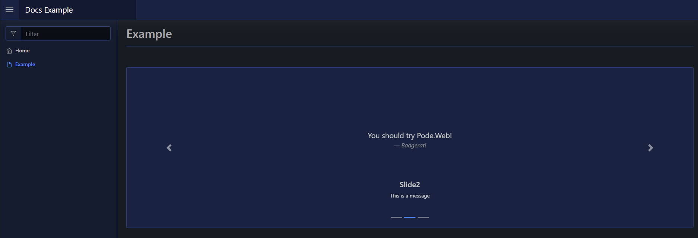

# Carousel

A carousel element is an array of slides with content, each slide can also have a title and a message. The slides will periodically move between one another, with arrows on either side to manually move to the next slide.

The slides take an array of elements via `-Content`.

## Usage

To create a carousel element you use [`New-PodeWebCarousel`](../../../Functions/Elements/New-PodeWebCarousel), and supply it an array of `-Slides` using [`New-PodeWebSlide`](../../../Functions/Elements/New-PodeWebSlide). The slides themselves accept an array of `-Content`.

For example, the below renders a carousel with 3 slides each containing an image, a title, and a message:

```powershell
New-PodeWebCarousel -Slides @(
    New-PodeWebSlide -Title Slide1 -Message 'This is a message' -Content @(
        New-PodeWebContainer -NoBackground -Content @(
            New-PodeWebQuote -Value 'Pode is awesome!' -Source 'Badgerati' -Alignment Center
        )
    )
    New-PodeWebSlide -Title Slide2 -Message 'This is a message' -Content @(
        New-PodeWebContainer -NoBackground -Content @(
            New-PodeWebQuote -Value 'You should try Pode.Web!' -Source 'Badgerati' -Alignment Center
        )
    )
    New-PodeWebSlide -Title Slide3 -Message 'This is a message' -Content @(
        New-PodeWebContainer -NoBackground -Content @(
            New-PodeWebQuote -Value 'PowerShell rocks!' -Source 'Badgerati' -Alignment Center
        )
    )
)
```

Which would look like below:


