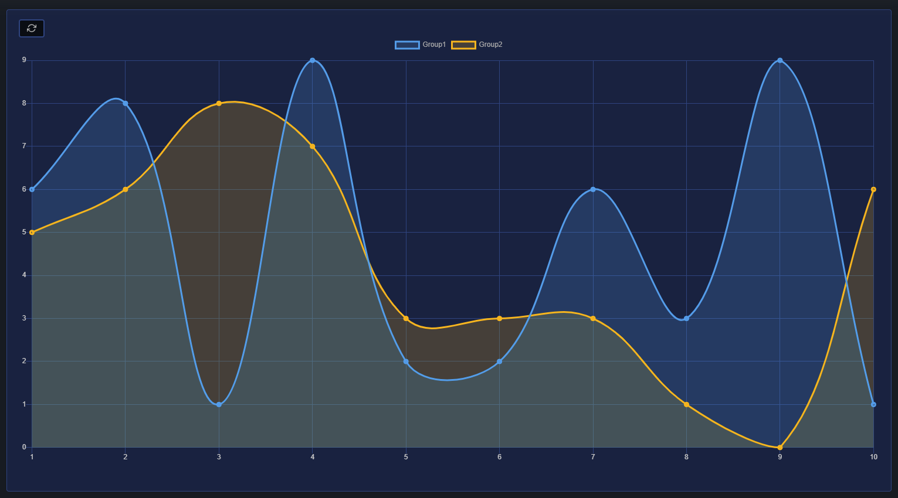
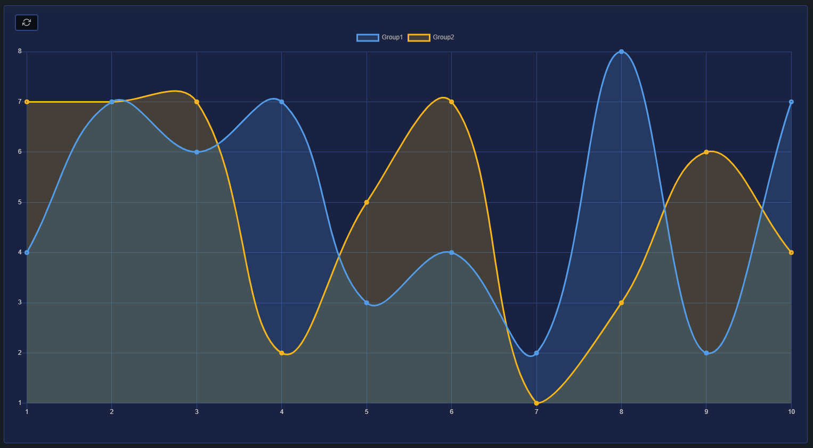
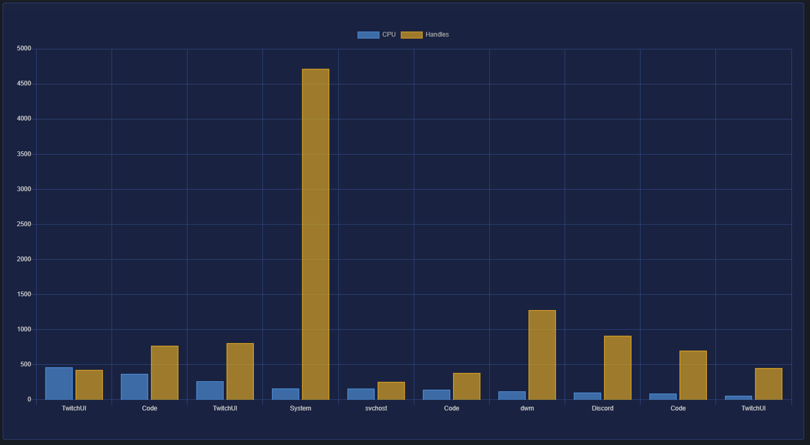
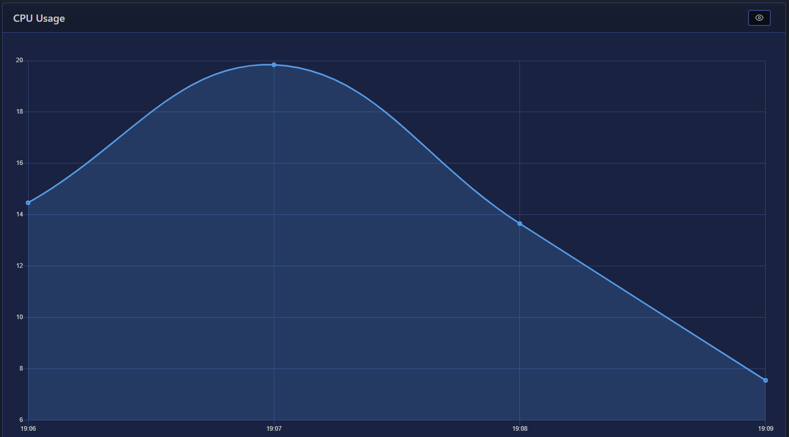
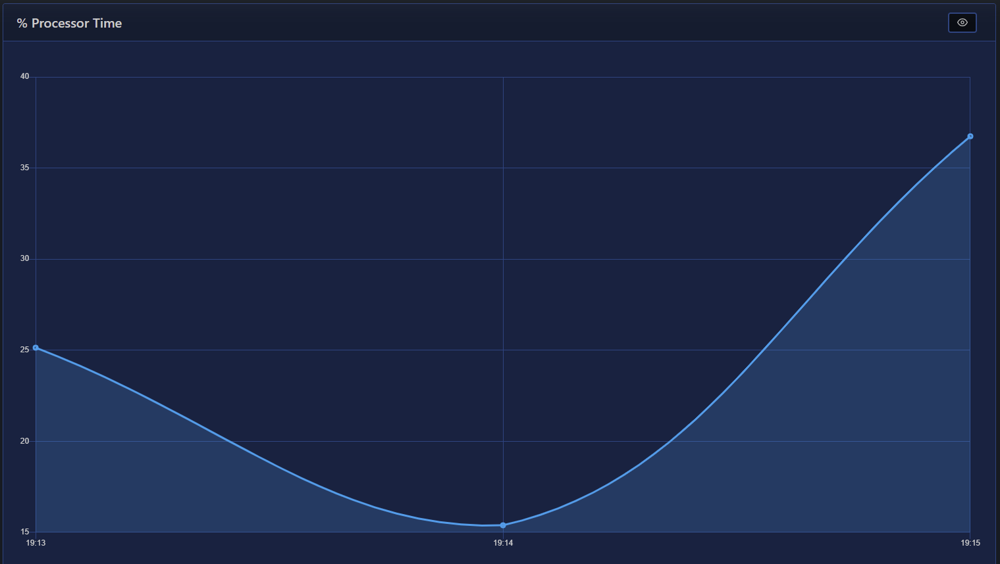

# Charts

| Support | |
| ------- |-|
| Events | No |

You can display data rendered as a chart by using [`New-PodeWebChart`](../../../Functions/Elements/New-PodeWebChart), and the following chart types are supported:

* Line (default)
* Bar
* Pie
* Doughnut

A chart gets its data from a supplied `-ScriptBlock`, more information below, and you can set a `-MaxItems` to be shown, and whether new data points should `-Append` to the chart. You can also `-AutoRefresh` a chart, to fetch new data every minute.

## Data

To supply data to be rendered on a chart, you have to supply a `-ScritpBlock` which returns the appropriate data in the correct format; fortunately there's [`ConvertTo-PodeWebChartData`](../../../Functions/Outputs/ConvertTo-PodeWebChartData) to help with this format.

You can pass values to the scriptblock by using the `-ArgumentList` parameter. This accepts an array of values/objects, and they are supplied as parameters to the scriptblock:

```powershell
New-PodeWebChart -Name 'Example Chart' -Type Line -ArgumentList 'Value1', 2, $false -ScriptBlock {
    param($value1, $value2, $value3)

    # $value1 = 'Value1'
    # $value2 = 2
    # $value3 = $false
}
```

### Raw

Before showing the ConvertTo function, the data format needed is as follows: the returned value has be an array of hashtables, with each hashtable requires a `Key` property, and a `Values` property that's an array of further hashtables. The `Key` is the value used on the X-axis, and the `Values` is an array of data points used on the Y-axis. The `Values` hashtables also has to contain a `Key` and a `Value` property - the `Key` here is the dataset group name, and the `Value` is the value on the Y-axis.

For example, the below will show a line chart consisting of 10 data points across 2 groups: Group1/Group2:

```powershell
New-PodeWebContainer -Content @(
    New-PodeWebChart -Name 'Example Chart' -Type Line -ScriptBlock {
        return (1..10 | ForEach-Object {
            @{
                Key = $_ # x-axis value
                Values = @(
                    @{
                        Key = 'Group1'
                        Value = (Get-Random -Maximum 10) # y-axis value
                    }
                    @{
                        Key = 'Group2'
                        Value = (Get-Random -Maximum 10) # y-axis value
                    }
                )
            }
        })
    }
)
```

which renders a chart that looks like below:



If you click the refresh button in the top-left corner, the `-ScriptBlock` will be re-invoked, and the chart updated:




### ConvertTo

The [`ConvertTo-PodeWebChartData`](../../../Functions/Outputs/ConvertTo-PodeWebChartData) helps to simplify the above a raw format, by letting you convert data at the end of a pipeline. The function takes a `-LabelProperty` which is the name of a property in the input that should be used for the X-axis, and then a `-DatasetProperty` with is property names for Y-axis values.

For example, let's say we want to display the top 10 processes using the most CPU. We want to display the process name, and its CPU and Memory usage, *and* we want it to auto-refresh every minute:

```powershell
New-PodeWebContainer -Content @(
    New-PodeWebChart -Name 'Top Processes' -Type Bar -AutoRefresh -ScriptBlock {
        Get-Process |
            Sort-Object -Property CPU -Descending |
            Select-Object -First 10 |
            ConvertTo-PodeWebChartData -LabelProperty ProcessName -DatasetProperty CPU, Handles
    }
)
```

which renders a chart that looks like below:



## Append

Now let's say we want `-AutoRefresh` a chart every minute, and we want it to display the current CPU usage, but only for the last 15 minutes. To do this, you have to supply `-Append` and any data returned from the `-ScriptBlock` will be appended to the chart instead. To restrict the data points to 15 minutes, we can supply `-MaxItems 15`.

It would also be nice to have the X-axis labels be timestamps, and Pode.Web can automatically show a data points time stamp by using the `-TimeLabels` switch.

The below example would render this chart for us:

```powershell
New-PodeWebChart -Name 'CPU Usage' -Type Line -AutoRefresh -Append -TimeLabels -MaxItems 15 -AsCard -ScriptBlock {
    return @{
        Values = ((Get-Counter -Counter '\Processor(_Total)\% Processor Time' -SampleInterval 1 -MaxSamples 2).CounterSamples.CookedValue | Measure-Object -Average).Average
    }
}
```

which renders a chart that looks like below:



### First Load

The scriptblock has access to the `$WebEvent`, and when a chart requests its `-ScriptBlock` for the first time, `$WebEvent.Data.FirstLoad` will have a value of `'1'`. This will let you preload data on your chart on its first load, and then just return 1 data point thereafter to be appended.

## Windows Counters

To display line charts for Windows Performance Counters more easily, Pode.Web has an inbuilt [`New-PodeWebCounterChart`](../../../Functions/Elements/New-PodeWebCounterChart). When used, this automatically sets up an auto-refreshing, timestamped, appending line chart for you; all you have to do is supply the name of the counter, and it will show a chart for up to the last 30mins.

For example, taking the above CPU example, this would be it using the inbuilt helper:

```powershell
New-PodeWebCounterChart -Counter '\Processor(_Total)\% Processor Time' -AsCard
```

which renders a chart that looks like below:


