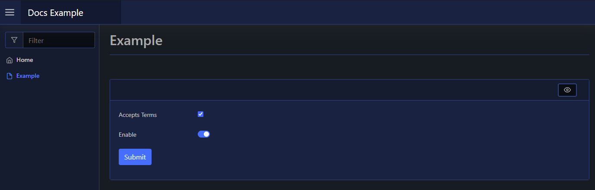
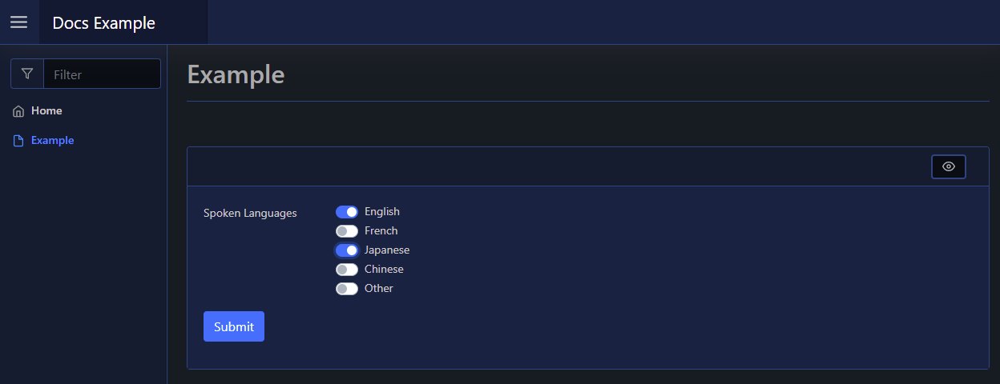

# Checkbox

| Support | |
| ------- |-|
| Events | Yes |

The Checkbox element is a form input element, and can be added using [`New-PodeWebCheckbox`](../../../Functions/Elements/New-PodeWebCheckbox). This will add a checkbox to your form, and you can render with checkbox as a switch using `-AsSwitch`:

```powershell
New-PodeWebCard -Content @(
    New-PodeWebForm -Name 'Example' -ScriptBlock {
        $accept = $WebEvent.Data['Accept Terms']
        $enable = $WebEvent.Data['Enable']
    } -Content @(
        New-PodeWebCheckbox -Name 'Accepts Terms'
        New-PodeWebCheckbox -Name 'Enable' -Checked -AsSwitch
    )
)
```

When using singular checkboxes like above, the value in `$WebEvent` will be `true` or `false` strings.

Which looks like below:



You can also setup a checkbox to have multiple options like below; in this case, the value will be a comma separated list of the selected options:

```powershell
New-PodeWebCard -Content @(
    New-PodeWebForm -Name 'Example' -ScriptBlock {
        $langs = $WebEvent.Data['Spoken Languages']
    } -Content @(
        New-PodeWebCheckbox -Name 'Spoken Languages' -Options 'English', 'French', 'Japanese', 'Chinese', 'Other' -AsSwitch
    )
)
```

Which looks like below:



## Display Name

By default the label displays the `-Name` of the element. You can change the value displayed by also supplying an optional `-DisplayName` value; this value is purely visual, when the user submits the form the value of the element is still retrieved using the `-Name` from `$WebEvent.Data`.

## Display Options

By default the options displayed are from the `-Options` parameter. Like the Name, you can change the values displayed by supplying the optional `-DisplayOptions` - values in the array should be in the same order as the values in `-Options`. These values are, like the Display Name, purely visual, and when the form is submitted the server receives the original values from `-Options`.
