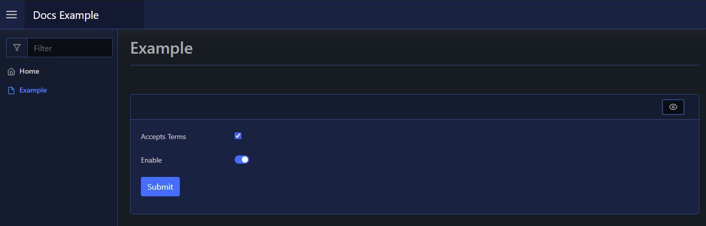
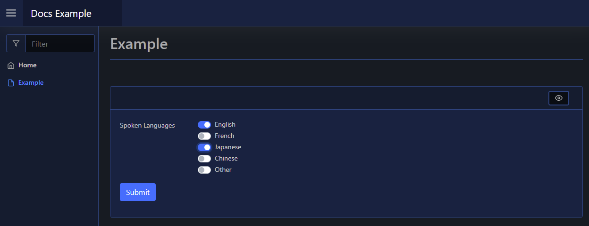

# Checkbox

| Support |     |
| ------- | --- |
| Events  | Yes |

The Checkbox element is a form input element, and can be added using [`New-PodeWebCheckbox`](../../../Functions/Elements/New-PodeWebCheckbox). This will add a checkbox to your form, and you can render with checkbox as a switch using `-AsSwitch`.

## Options

### Single

To create a Checkbox element with a single option, you simply need to supply just the `-Name`:

```powershell
New-PodeWebCard -Content @(
    New-PodeWebForm -Name 'Example' -ScriptBlock {
        $accept = $WebEvent.Data['Accept Terms']
        $enable = $WebEvent.Data['Enable']
    } -Content @(
        New-PodeWebCheckbox -Name 'Accepts Terms'
        New-PodeWebCheckbox -Name 'Enable' -Selected -AsSwitch
    )
)
```

When using single option checkboxes, the value in `$WebEvent.Data` value will be a `true` string - or omitted for deselected Checkboxes.



### Multiple

To create a Checkbox element with multiple pre-defined options, you can use the `-Options` parameter which accepts an array of [`New-PodeWebOption`](../../../Functions/Elements/New-PodeWebOption):

```powershell
New-PodeWebCard -Content @(
    New-PodeWebForm -Name 'Example' -ScriptBlock {
        $langs = $WebEvent.Data['Spoken Languages']
    } -Content @(
        New-PodeWebCheckbox -Name 'Spoken Languages' -AsSwitch -Options @(
            New-PodeWebOption -Name 'English' -Selected
            New-PodeWebOption -Name 'French'
            New-PodeWebOption -Name 'Japanese'
            New-PodeWebOption -Name 'Chinese'
            New-PodeWebOption -Name 'Other'
        )
    )
)
```

Which looks like below:



### Dynamic

You can build a Checkbox element's options dynamically by using the `-ScriptBlock` parameter. This will allow you to retrieve the options from elsewhere for use with the Checkbox element.

You can either return an array of raw string values, or pipe the options into, and return, [`Update-PodeWebCheckbox`](../../../Functions/Actions/Update-PodeWebCheckbox). When using the latter you will need to supply the options as Option elements, for this you can either build the options using [`New-PodeWebOption`](../../../Functions/Elements/New-PodeWebOption) or convert raw values via [`ConvertTo-PodeWebOption`](../../../Functions/Elements/ConvertTo-PodeWebOption).

The following will both build a Checkbox element with 10 random numbers as the options, using the above methods:

```powershell
New-PodeWebCard -Content @(
    New-PodeWebForm -Name 'Example' -ScriptBlock {
        # return raw values for Pode.Web to convert
        New-PodeWebCheckbox -Name 'RawValues' -ScriptBlock {
            foreach ($i in (1..10)) {
                Get-Random -Minimum 1 -Maximum 10
            }
        }

        # use New-PodeWebOption
        New-PodeWebCheckbox -Name 'NewToUpdate' -ScriptBlock {
            $options = @(foreach ($i in (1..10)) {
                New-PodeWebOption -Name (Get-Random -Minimum 1 -Maximum 10)
            })

            $options | Update-PodeWebCheckbox -Id $ElementData.Id
        }

        # use ConvertTo-PodeWebOption
        New-PodeWebCheckbox -Name 'NewToUpdate' -ScriptBlock {
            $options = @(foreach ($i in (1..10)) {
                Get-Random -Minimum 1 -Maximum 10
            })

            $options |
                ConvertTo-PodeWebOption |
                Update-PodeWebCheckbox -Id $ElementData.Id
        }
    }
)
```

## Display Name

By default the label displays the `-Name` of the element. You can change the value displayed by also supplying an optional `-DisplayName` value; this value is purely visual, when the user submits the form the value of the element is still retrieved using the `-Name` from `$WebEvent.Data`.

The same principle applies to `New-PodeWebOption` and `-DisplayName`.
