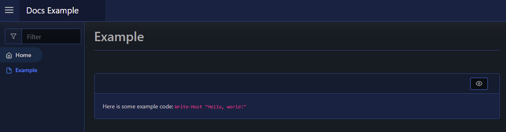

# Code

| Support | |
| ------- |-|
| Events | No |

The code element will render pre-formatted text as `<code>value</code>`. To create a code element you use [`New-PodeWebCode`](../../../Functions/Elements/New-PodeWebCode):

```powershell
New-PodeWebCard -Content @(
    New-PodeWebText -Value 'Here is some example code: '
    New-PodeWebCode -Value 'Write-Host "Hello, world!"'
)
```

Which looks like below:


