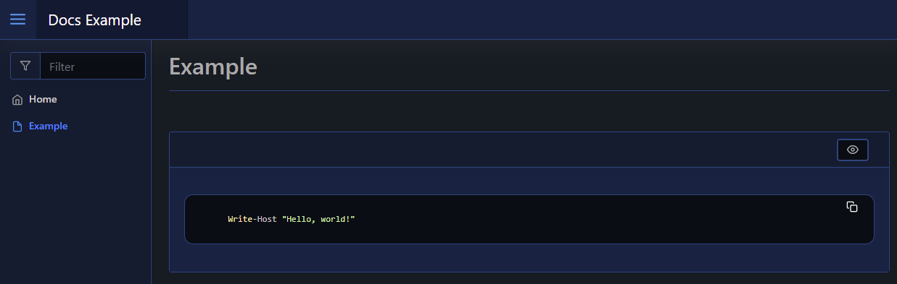

# Code Block

The code block element will render pre-formatted text as `<pre>value</pre>`. To create a code block element you use [`New-PodeWebCodeBlock`](../../../Functions/Elements/New-PodeWebCodeBlock), and you can specify the highlighting language via `-Language` - the default is plain text.

```powershell
New-PodeWebCard -Content @(
    New-PodeWebCodeBlock -Value 'Write-Host "Hello, world!"' -Language PowerShell
)
```

Which looks like below:


