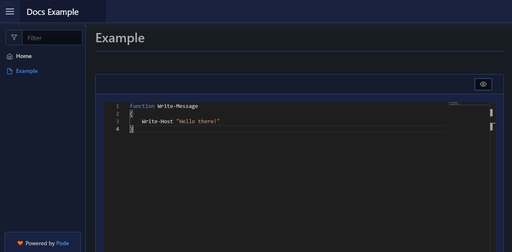
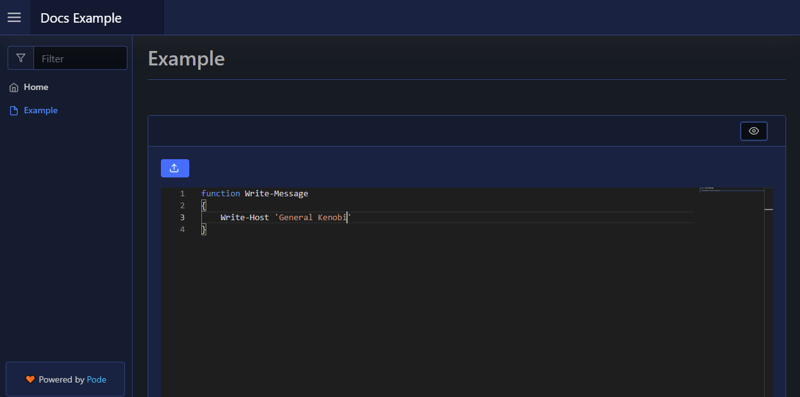

# Code Editor

The code editor, which is done using MicroSoft's Monaco Editor, is currently still a WIP but functional. You can add a code editor to your page via [`New-PodeWebCodeEditor`], and specify the language is editor is for via `-Language`.

To display the editor with some initial content you can supply `-Value`:

```powershell
New-PodeWebCard -Content @(
    New-PodeWebCodeEditor -Name 'Editor' -Language 'powershell'
)
```

Which looks like below:



## Upload

You can also supply an optional `-Upload` scriptblock, this will show a button at the top of the editor which, when clicked, will pass the editor's current value to the scriptblock. This will allow you to save the value:

```powershell
New-PodeWebCard -Content @(
    New-PodeWebCodeEditor -Name 'Editor' -Language 'powershell' -Upload {
        $WebEvent.Data | Out-Default
    }
)
```

Which looks like below:


