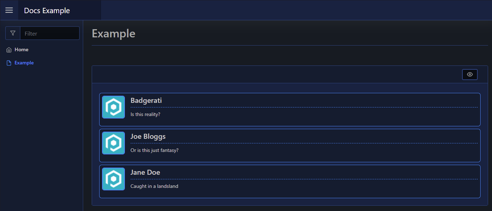

# Comment Block

| Support | |
| ------- |-|
| Events | No |

A Comment Block lets you display messages/comments on your page, showing a user's name, message and an icon/avatar. You can add comment blocks using [`New-PodeWebComment`](../../../Functions/Elements/New-PodeWebComment):

```powershell
New-PodeWebCard -Content @(
    New-PodeWebComment -Username 'Badgerati' -Message 'Is this reality?' -Icon '/pode.web-static/images/icon.png'
    New-PodeWebComment -Username 'Joe Bloggs' -Message 'Or is this just fantasy?' -Icon '/pode.web-static/images/icon.png'
    New-PodeWebComment -Username 'Jane Doe' -Message 'Caught in a landsland' -Icon '/pode.web-static/images/icon.png'
)
```

Which looks like below:



## Public Content

The `-Icon` parameter path for an image typically references media stored in a `public` folder in the project root. If the file system is case sensitive (default on Linux, but not on Windows), then the `public` folder in the project root MUST be all lower case. More details [available in Pode documentation](https://badgerati.github.io/Pode/Tutorials/Routes/Utilities/StaticContent/#public-directory).
