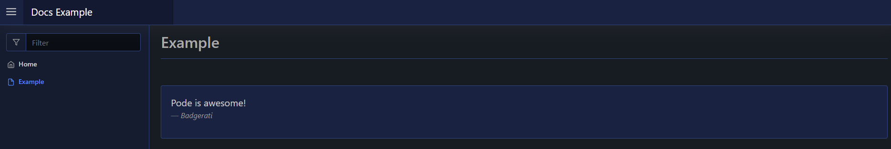
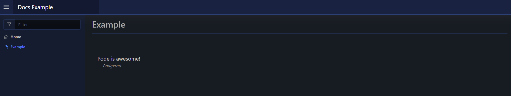

# Container

A container is similar to a card element, but it has not title, nor can it be collapsed. It's a way of group multiple elements together, with the option of making the background of the container transparent.

A container takes an array of elements via `-Content`.

## Usage

To create a container element you use [`New-PodeWebContainer`](../../../Functions/Elements/New-PodeWebContainer), and supply it an array of `-Content`.

For example, the below renders a container with a quote:

```powershell
New-PodeWebContainer -Content @(
    New-PodeWebQuote -Value 'Pode is awesome!' -Source 'Badgerati'
)
```

Which would look like below:



Or with no background:

```powershell
New-PodeWebContainer -NoBackground -Content @(
    New-PodeWebQuote -Value 'Pode is awesome!' -Source 'Badgerati'
)
```

Which would look like below:


