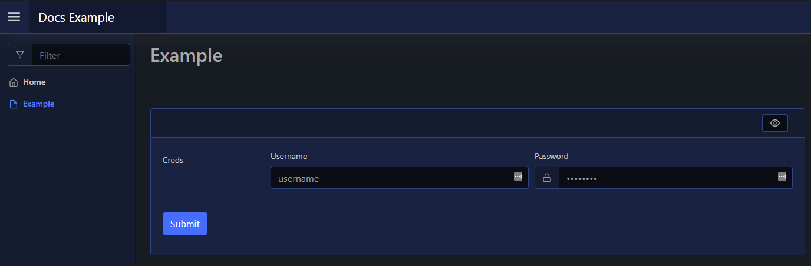

# Credentials

| Support | |
| ------- |-|
| Events | Yes |

The Credentials element is a form input element, and can be added using [`New-PodeWebCredential`](../../../Functions/Elements/New-PodeWebCredential). This will automatically add a username and password input fields to your form:

```powershell
New-PodeWebCard -Content @(
    New-PodeWebForm -Name 'Example' -ScriptBlock {
        $username = $WebEvent.Data['Creds_Username']
        $password = $WebEvent.Data['Creds_Password']
    } -Content @(
        New-PodeWebCredential -Name 'Creds'
    )
)
```

Which looks like below:



## Type

By default both the Username and Password fields are displayed, but you can control which ones are displayed by using the `-Type` parameter:

```powershell
# both (this is the default)
New-PodeWebCredential -Name 'Example' -Type Username, Password

# just username
New-PodeWebCredential -Name 'Example' -Type Username

# just password
New-PodeWebCredential -Name 'Example' -Type Password
```

## Display Name

By default the label displays the `-Name` of the element. You can change the value displayed by also supplying an optional `-DisplayName` value; this value is purely visual, when the user submits the form the value of the element is still retrieved using the `-Name` from `$WebEvent.Data`.
