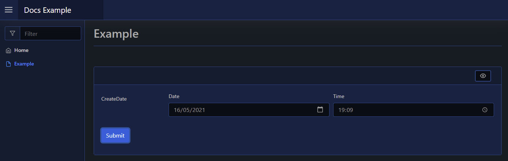

# DateTime

| Support | |
| ------- |-|
| Events | Yes |

The DateTime element is a form input element, and can be added using [`New-PodeWebDateTime`](../../../Functions/Elements/New-PodeWebDateTime). This will automatically add a date and time input fields to your form:

```powershell
New-PodeWebCard -Content @(
    New-PodeWebForm -Name 'Example' -ScriptBlock {
        $date = $WebEvent.Data['CreateDate_Date']
        $time = $WebEvent.Data['CreateDate_Time']
    } -Content @(
        New-PodeWebDateTime -Name 'CreateDate'
    )
)
```

Which looks like below:



## Type

By default both the Date and Time fields are displayed, but you can control which ones are displayed by using the `-Type` parameter:

```powershell
# both (this is the default)
New-PodeWebDateTime -Name 'Example' -Type Date, Time

# just date
New-PodeWebDateTime -Name 'Example' -Type Date

# just time
New-PodeWebDateTime -Name 'Example' -Type Time
```

## Display Name

By default the label displays the `-Name` of the element. You can change the value displayed by also supplying an optional `-DisplayName` value; this value is purely visual, when the user submits the form the value of the element is still retrieved using the `-Name` from `$WebEvent.Data`.
