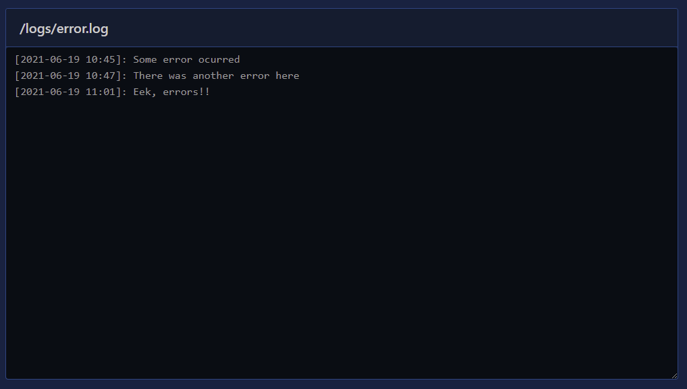

# File Stream

A file stream element is a readonly textarea that will stream the contents of a file from the server - usually a text/log file from the `/public` directory. To add a file streaming element to your page you can use [`New-PodeWebFileStream`](../../../Functions/Elements/New-PodeWebFileStream).

The simplest file stream just needs a `-Url` being supplied; this URL should be a relative/literal URL path to a static text file.

!!! important
    The server the file is being streamed from must support the Range HTPP header - Pode already supports this.

For example, the following will stream a log file from the `/public/logs/error.log` file:

```powershell
New-PodeWebContainer -Content @(
    New-PodeWebFileStream -Url '/logs/error.log'
)
```

Which looks like below:


You can control the height and refresh interval of the element via the `-Height` and `-Interval` parameters. The interval is specified as a number of seconds - the default is 10secs.

Each file stream element renders with a header which shows the file being streamed; you can hide the header using the `-NoHeader` switch.

## Connection

If the connection (or any error) occurs while streaming the file, then the header (or just the border if the header is hidden) will turn red and the streaming will stop.
