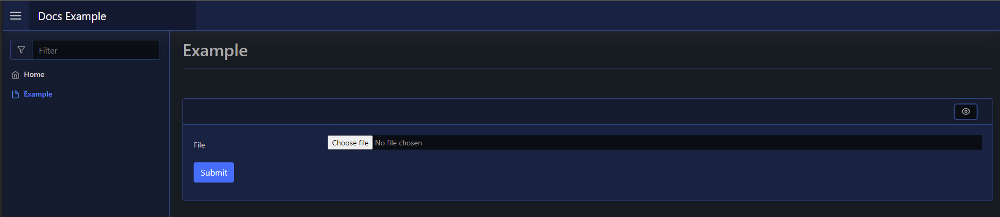

# File Upload

| Support | |
| ------- |-|
| Events | No |

The File Upload element is a form input element, and can be created using [`New-PodeWebFileUpload`](../../../Functions/Elements/New-PodeWebFileUpload). It allows users to upload files from your page forms:

```powershell
New-PodeWebCard -Content @(
    New-PodeWebForm -Name 'Example' -ScriptBlock {
        Save-PodeRequestFile -Key 'File' -Path 'C:\some\path\file.png'
    } -Content @(
        New-PodeWebFileUpload -Name 'File'
    )
)
```

Which looks like below:



## Inline

You can render this element inline with other non-form elements by using the `-NoForm` switch. This will remove the form layout, and render the element more cleanly when used outside of a form.

## Display Name

By default the label displays the `-Name` of the element. You can change the value displayed by also supplying an optional `-DisplayName` value; this value is purely visual, when the user submits the form the value of the element is still retrieved using the `-Name` from `$WebEvent.Data`.
