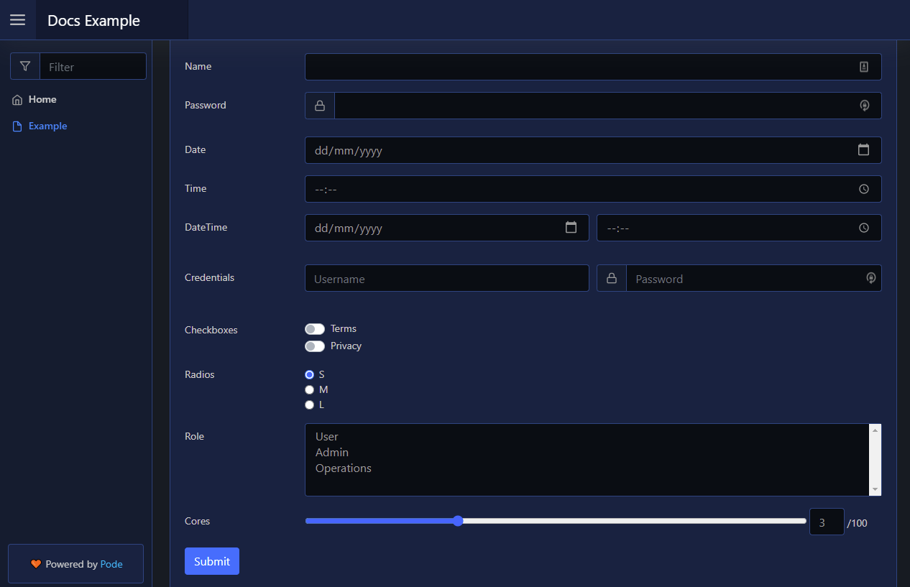

# Form

| Support | |
| ------- |-|
| Events | No |

A form is kind of like a layout, but is an element that contains other elements. It automatically wraps the `-Content` as a `<form>` and adds a submit button to the bottom. When clicked, the form is serialised and sent to the `-ScriptBlock`. To add a form to you page use [`New-PodeWebForm`](../../../Functions/Elements/New-PodeWebForm) along with other form elements:

```powershell
New-PodeWebCard -Content @(
    New-PodeWebForm -Name 'Example' -ScriptBlock {
        $WebEvent.Data | Out-Default
    } -Content @(
        New-PodeWebTextbox -Name 'Name' -AutoComplete {
            return @('billy', 'bobby', 'alice', 'john', 'sarah', 'matt', 'zack', 'henry')
        }
        New-PodeWebTextbox -Name 'Password' -Type Password -PrependIcon Lock
        New-PodeWebTextbox -Name 'Date' -Type Date
        New-PodeWebTextbox -Name 'Time' -Type Time
        New-PodeWebDateTime -Name 'DateTime' -NoLabels
        New-PodeWebCredential -Name 'Credentials' -NoLabels
        New-PodeWebCheckbox -Name 'Checkboxes' -Options @('Terms', 'Privacy') -AsSwitch
        New-PodeWebRadio -Name 'Radios' -Options @('S', 'M', 'L')
        New-PodeWebSelect -Name 'Role' -Options @('User', 'Admin', 'Operations') -Multiple
        New-PodeWebRange -Name 'Cores' -Value 30 -ShowValue
    )
)
```

Which looks like below:



You can pass values to the scriptblock by using the `-ArgumentList` parameter. This accepts an array of values/objects, and they are supplied as parameters to the scriptblock:

```powershell
New-PodeWebForm -Name 'Example' -ArgumentList 'Value1', 2, $false -ScriptBlock {
    param($value1, $value2, $value3)

    # $value1 = 'Value1'
    # $value2 = 2
    # $value3 = $false
} -Content @()
```

## Elements

The available form elements in Pode.Web are:

* [Checkbox](../Checkbox)
* [Credentials](../Credentials)
* [DateTime](../DateTime)
* [FileUpload](../FileUpload)
* [Hidden](../Hidden)
* [MinMax](../DateTime)
* [Range](../Range)
* [Radio](../Radio)
* [Range](../Range)
* [Select](../Select)
* [Textbox](../Textbox)

## Method/Action

The default method for forms is `Post`, and the action is the internal route created for the form.

You can change these values by using the `-Method` and `-Action` parameters. The method can only be `Get` or `Post`, and the action must be a valid URL.
