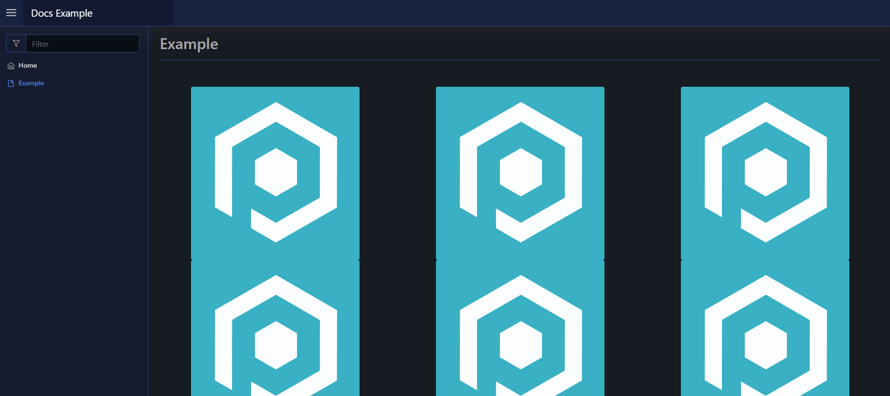

# Grid

| Support |     |
| ------- | --- |
| Events  | No  |

A grid element is an array of cells with content, equally spaced in size, that can be either horizontal or vertical in orientation.

The cells take an array of elements via `-Content`.

## Usage

To create a grid you use [`New-PodeWebGrid`](../../../Functions/Elements/New-PodeWebGrid), and supply it an array of `-Cells` using [`New-PodeWebCell`](../../../Functions/Elements/New-PodeWebCell). The cells themselves accept an array of `-Content`.

For example, the below renders a 3-celled horizontal grid of centered images:

```powershell
New-PodeWebGrid -Cells @(
    New-PodeWebCell -Content @(
        New-PodeWebImage -Source '/pode.web-static/images/icon.png' -Alignment Center
    )
    New-PodeWebCell -Content @(
        New-PodeWebImage -Source '/pode.web-static/images/icon.png' -Alignment Center
    )
    New-PodeWebCell -Content @(
        New-PodeWebImage -Source '/pode.web-static/images/icon.png' -Alignment Center
    )
)
```

Which would look like below:


A grid also has an optional `-Width` parameter, and when this parameter isn't supplied the cells are all placed into one horizontal row. However, if you supply a `-Width` then this limits the number of cells that can be rendered on a row. For example, if you pass 7 cells with a width of 3, then you'll end up with 3 rows: 2 rows of 3 cells and 1 row of 1 cell - the last row is padded to match the width of the other rows.

### Vertical

You can render the cells of a grid vertically by either supplying `-Width 1` or by using the `-Vertical` switch on [`New-PodeWebGrid`](../../../Functions/Elements/New-PodeWebGrid):

```powershell
New-PodeWebGrid -Vertical -Cells @(
    New-PodeWebCell -Content @(
        New-PodeWebImage -Source '/pode.web-static/images/icon.png' -Alignment Center
    )
    New-PodeWebCell -Content @(
        New-PodeWebImage -Source '/pode.web-static/images/icon.png' -Alignment Center
    )
    New-PodeWebCell -Content @(
        New-PodeWebImage -Source '/pode.web-static/images/icon.png' -Alignment Center
    )
)
```

Which would look like below:


## Grids in Grids

You can put grids within grids to render a multi-dimensional grid/cell element. For example, to create a 3x3 grid of cells with images:

```powershell
New-PodeWebGrid -Cells @(
    New-PodeWebCell -Content @(
        New-PodeWebGrid -Vertical -Cells @(
            New-PodeWebCell -Content @(
                New-PodeWebImage -Source '/pode.web-static/images/icon.png' -Alignment Center
            )
            New-PodeWebCell -Content @(
                New-PodeWebImage -Source '/pode.web-static/images/icon.png' -Alignment Center
            )
            New-PodeWebCell -Content @(
                New-PodeWebImage -Source '/pode.web-static/images/icon.png' -Alignment Center
            )
        )
    )
    New-PodeWebCell -Content @(
        New-PodeWebGrid -Vertical -Cells @(
            New-PodeWebCell -Content @(
                New-PodeWebImage -Source '/pode.web-static/images/icon.png' -Alignment Center
            )
            New-PodeWebCell -Content @(
                New-PodeWebImage -Source '/pode.web-static/images/icon.png' -Alignment Center
            )
            New-PodeWebCell -Content @(
                New-PodeWebImage -Source '/pode.web-static/images/icon.png' -Alignment Center
            )
        )
    )
    New-PodeWebCell -Content @(
        New-PodeWebGrid -Vertical -Cells @(
            New-PodeWebCell -Content @(
                New-PodeWebImage -Source '/pode.web-static/images/icon.png' -Alignment Center
            )
            New-PodeWebCell -Content @(
                New-PodeWebImage -Source '/pode.web-static/images/icon.png' -Alignment Center
            )
            New-PodeWebCell -Content @(
                New-PodeWebImage -Source '/pode.web-static/images/icon.png' -Alignment Center
            )
        )
    )
)
```

Which would look like below:



The above is useful if you want pure control over the grid element. However, the following would also produce a 3x3 grid by just using the `-Width` parameter, and supplying all the cells to one grid:

```powershell
New-PodeWebGrid -Width 3 -Cells @(
    New-PodeWebCell -Content @(
        New-PodeWebImage -Source '/pode.web-static/images/icon.png' -Alignment Center
    )
    New-PodeWebCell -Content @(
        New-PodeWebImage -Source '/pode.web-static/images/icon.png' -Alignment Center
    )
    New-PodeWebCell -Content @(
        New-PodeWebImage -Source '/pode.web-static/images/icon.png' -Alignment Center
    )
    New-PodeWebCell -Content @(
        New-PodeWebImage -Source '/pode.web-static/images/icon.png' -Alignment Center
    )
    New-PodeWebCell -Content @(
        New-PodeWebImage -Source '/pode.web-static/images/icon.png' -Alignment Center
    )
    New-PodeWebCell -Content @(
        New-PodeWebImage -Source '/pode.web-static/images/icon.png' -Alignment Center
    )
    New-PodeWebCell -Content @(
        New-PodeWebImage -Source '/pode.web-static/images/icon.png' -Alignment Center
    )
    New-PodeWebCell -Content @(
        New-PodeWebImage -Source '/pode.web-static/images/icon.png' -Alignment Center
    )
    New-PodeWebCell -Content @(
        New-PodeWebImage -Source '/pode.web-static/images/icon.png' -Alignment Center
    )
)
```

## Cell Width

You can optionally specify the width of a cell within a grid, by using the `-Width` parameter on [`New-PodeWebCell`](../../../Functions/Elements/New-PodeWebCell). A grid is split up into 12 segments, and the `-Width` parameter lets you specify a value between 1 and 12. A value of 12 means the cells takes up the full width of the grid, where as 6 would be half the width.

You can also supply the value as a percentage as well; 50% being 6 segments, etc.

```powershell
New-PodeWebGrid -Cells @(
    New-PodeWebCell -Width 6 -Content @(
        New-PodeWebImage -Source '/pode.web-static/images/icon.png' -Alignment Center
    )
    New-PodeWebCell -Width '25%' -Content @(
        New-PodeWebImage -Source '/pode.web-static/images/icon.png' -Alignment Center
    )
    New-PodeWebCell -Width 3 -Content @(
        New-PodeWebImage -Source '/pode.web-static/images/icon.png' -Alignment Center
    )
)
```

The above example would display a grid, with 1 cell occupying 50% of the width, and the last 2 just 25% each.
