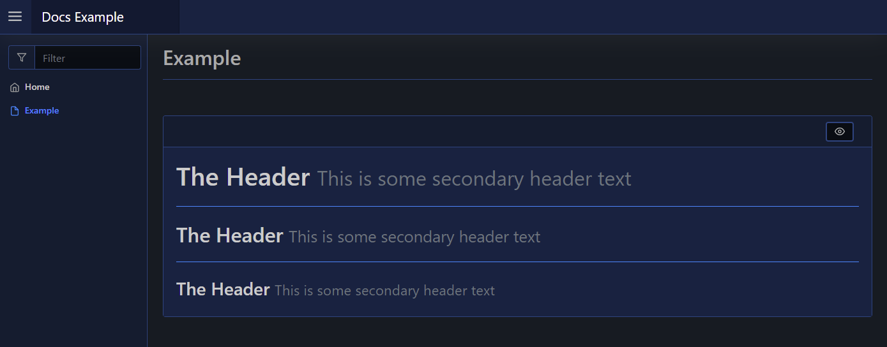

# Header

| Support | |
| ------- |-|
| Events | No |

You can render header titles to your page by using [`New-PodeWebHeader`](../../../Functions/Elements/New-PodeWebHeader). This will show a title in various header sizes (`h1` - `h6`):

```powershell
New-PodeWebCard -Content @(
    New-PodeWebHeader -Value 'The Header' -Size 1 -Secondary 'This is some secondary header text'
    New-PodeWebLine
    New-PodeWebHeader -Value 'The Header' -Size 2 -Secondary 'This is some secondary header text'
    New-PodeWebLine
    New-PodeWebHeader -Value 'The Header' -Size 3 -Secondary 'This is some secondary header text'
)
```

Which looks like below:


