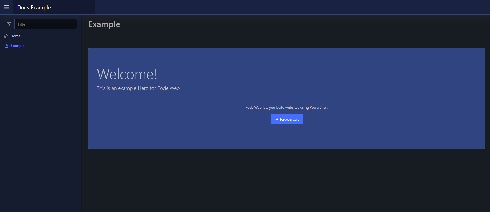

# Hero

A hero is an element that renders with a title, message, and extra optional content. They're the big display messages that are normally seen at the top of websites with buttons like "Download Now!" etc.

A hero can take an array of elements via `-Content`.

## Usage

To create a hero element you use [`New-PodeWebHero`](../../../Functions/Elements/New-PodeWebHero), and supply it a `-Title`, `-Message`, and an optional array of `-Content`.

For example, the below renders a hero with a title, message, and content for further text and a button:

```powershell
New-PodeWebHero -Title 'Welcome!' -Message 'This is an example Hero for Pode.Web' -Content @(
    New-PodeWebText -Value 'Pode.Web lets you build websites using PowerShell.' -InParagraph -Alignment Center
    New-PodeWebParagraph -Alignment Center -Content @(
        New-PodeWebButton -Name 'Repository' -Icon Link -Url 'https://github.com/Badgerati/Pode.Web'
    )
)
```

Which would look like below:


