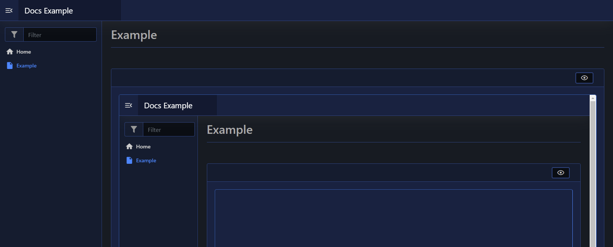

# iFrame

| Support | |
| ------- |-|
| Events | No |

The iFrame element lets you embed other websites into your pages via [`New-PodeWebIFrame`](../../../Functions/Elements/New-PodeWebIFrame), and you just need to supply the `-Url` to embed:

```powershell
New-PodeWebCard -Content @(
    New-PodeWebIFrame -Url '/'
)
```

Which looks like below:


