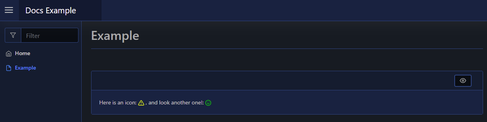

# Icon

| Support | |
| ------- |-|
| Events | Yes |

The icon element will render a [Material Design Icon](https://materialdesignicons.com) to your page. To create an icon element you use [`New-PodeWebIcon`](../../../Functions/Elements/New-PodeWebIcon), and supply the name of a Material Design Icon using `-Name`; you can also change the icon colour via `-Colour` which can be a known name (red/green/etc) or a hex value (#333333).

```powershell
New-PodeWebCard -Content @(
    New-PodeWebText -Value 'Here is an icon: '
    New-PodeWebIcon -Name 'alert' -Colour 'yellow'
    New-PodeWebText -Value ', and look another one!: '
    New-PodeWebIcon -Name 'emoticon-happy' -Colour '#00CC00'
)
```

Which looks like below:



## Actions

### Flip

You can flip an icon by passing `Horizontal` or `Vertical` to the `-Flip` parameter. You cannot supply both flip and rotate together.

### Rotate

You can rotate an icon by a fixed number of degrees by supplying a value, 45-315 in 45 degree increments, to the `-Rotate` parameter. You cannot supply both flip and rotate together.

### Spin

You can make an icon spin by supplying the `-Spin` switch.

## Size

By default the size of the icon is based on the element the icon is within - such as a paragraph or a header. However, you can override this size by supplying a value for the `-Size` parameter.

!!! important
    The `-Size` parameter only accepts value between 0-50, and in increments of 5. A value of 0 will use the default sizing rules for icons.

```powershell
New-PodeWebIcon -Name 'home' -Size 40
```

## Icon Presets

### Toggle

You can set a predefined icon set for icon toggling by passing a new icon to the `-ToggleIcon` parameter. To create the icon preset use the [`New-PodeWebIconPreset`] function - this has the `-Name` and other parameters as optional, and if not defined the base Icon's details are used instead. To swap from the base icon to the toggle icon you can use the [`Switch-PodeWebIcon`] action function as detailed [here](../../Actions/Icon#switch).

For example:

```powershell
# this will add a toggle icon to make the base icon go yellow and spin:
$toggle = New-PodeWebIconPreset -Colour Yellow -Spin
New-PodeWebIcon -Name 'cat' -ToggleIcon $toggle

# this will add a toggle icon to change the base icon completely
$toggle = New-PodeWebIconPreset -Name 'cat'
New-PodeWebIcon -Name 'home' -ToggleIcon $toggle
```

### Hover

Similar to the toggle icon preset above, you can do the same with a hover icon preset by supplying a [`New-PodeWebIconPreset`] to the `-HoverIcon` parameter. This icon can also be switched to by using [`Switch-PodeWebIcon`] as well, but with a hover icon Pode.Web will automatically swap to this icon when the icon is hovered over.

```powershell
# this will add a hover icon to change from outlined checkbox to a full one on hover
$hover = New-PodeWebIconPreset -Name 'mdi-checkbox-multiple-marked'
New-PodeWebIcon -Name 'mdi-checkbox-multiple-marked-outline' -HoverIcon $hover
```
