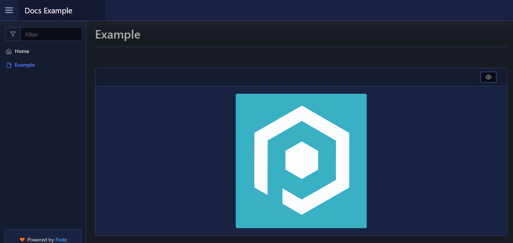

# Image

| Support | |
| ------- |-|
| Events | Yes |

This will render an image onto your page, using [`New-PodeWebImage`](../../../Functions/Elements/New-PodeWebImage). You need to supply a `-Source` URL to the image you wish to display:

```powershell
New-PodeWebCard -Content @(
    New-PodeWebImage -Source '/pode.web-static/images/icon.png' -Title 'Pode' -Alignment Center
)
```

Which looks like below:



## Size

The `-Width` and `-Height` of an image have the default unit of `px`. If `0` is specified then `auto` is used instead. Any custom value such as `10%` can be used, but if a plain number is used then `px` is appended.
