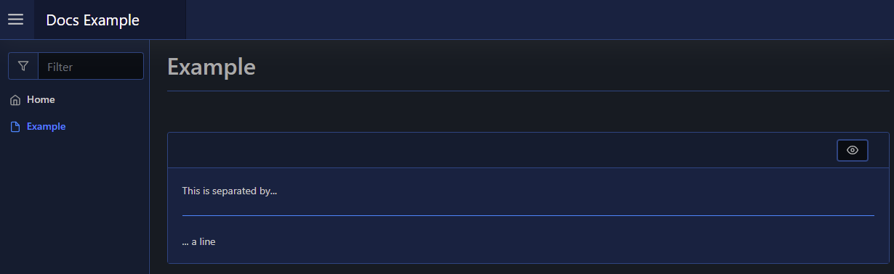

# Line

| Support | |
| ------- |-|
| Events | No |

This will render a line (`<hr>`) to your page, using [`New-PodeWebLine`](../../../Functions/Elements/New-PodeWebLine):

```powershell
New-PodeWebCard -Content @(
    New-PodeWebText -Value 'This is separated by...'
    New-PodeWebLine
    New-PodeWebText -Value '... a line'
)
```

Which looks like below:


