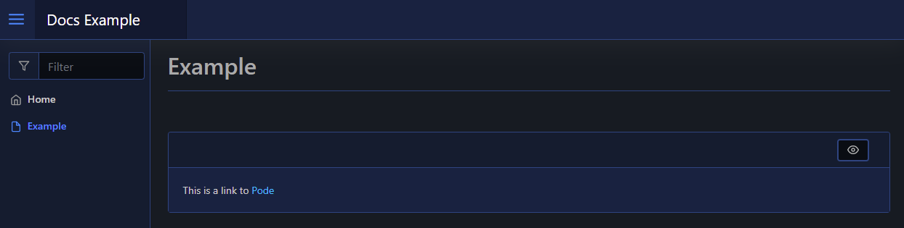

# Link

This will render a hyperlink (`<a>`) to your page, using [`New-PodeWebLink`](../../../Functions/Elements/New-PodeWebLink). You need to supply a `-Source` (the href), and a `-Value` to show to the user:

```powershell
New-PodeWebCard -Content @(
    New-PodeWebText -Value 'This is a link to '
    New-PodeWebLink -Source 'https://github.com/Badgerati/Pode' -Value 'Pode'
)
```

Which looks like below:



## New Tab

To open the link in a new tab, supply the `-NewTab` switch:

```powershell
New-PodeWebLink -Source 'https://github.com/Badgerati/Pode' -Value 'Pode' -NewTab
```
