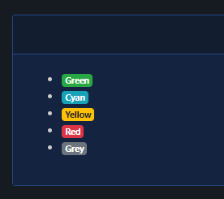
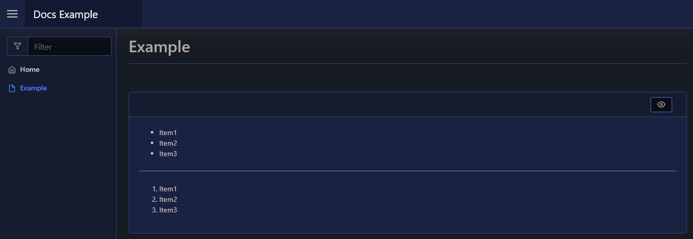

# List

| Support |     |
| ------- | --- |
| Events  | No  |

Pode.Web lets you display lists of items, either bullet pointed or numbered, using [`New-PodeWebList`](../../../Functions/Elements/New-PodeWebList). You need to supply an array of `-Items` or `-Values`, and then the `-Numbered` flag for numbered lists.

## Items

The `-Items` parameter takes an array of ListItem elements (created via [`New-PodeWebListItem`](../../../Functions/Elements/New-PodeWebListItem)). The ListItem element accepts an array of `-Content`, which is an array of other elements:

```powershell
New-PodeWebCard -Content @(
    New-PodeWebList -Items @(
        New-PodeWebListItem -Content @(
            New-PodeWebBadge -Colour Green -Value 'Green'
        )
        New-PodeWebListItem -Content @(
            New-PodeWebBadge -Colour Cyan -Value 'Cyan'
        )
        New-PodeWebListItem -Content @(
            New-PodeWebBadge -Colour Yellow -Value 'Yellow'
        )
        New-PodeWebListItem -Content @(
            New-PodeWebBadge -Colour Red -Value 'Red'
        )
        New-PodeWebListItem -Content @(
            New-PodeWebBadge -Colour Grey -Value 'Grey'
        )
    )
)
```

Which looks like below:



## Values

The `-Values` parameter takes an array of strings, and renders them as a normal list:

```powershell
New-PodeWebCard -Content @(
    New-PodeWebList -Values 'Item1', 'Item2', 'Item3'
    New-PodeWebLine
    New-PodeWebList -Values 'Item1', 'Item2', 'Item3' -Numbered
)
```

Which looks like below:


