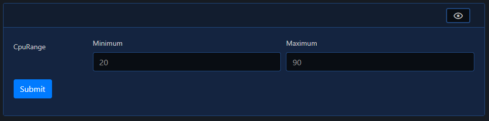

# MinMax

| Support | |
| ------- |-|
| Events | Yes |

The MinMax element is a form input element, and can be added using [`New-PodeWebMinMax`](../../../Functions/Elements/New-PodeWebMinMax). This will add a pair of number type textboxes to your form to allow input of minimum/maximum values, you can set preset values using `-MinValue` and `-MaxValue`:

```powershell
New-PodeWebCard -Content @(
    New-PodeWebForm -Name 'Example' -ScriptBlock {
        $min = $WebEvent.Data['CpuRange_Min']
        $max = $WebEvent.Data['CpuRange_Max']
    } -Content @(
        New-PodeWebMinMax -Name 'CpuRange' -MinValue 20 -MaxValue 90
    )
)
```

Which looks like below:


