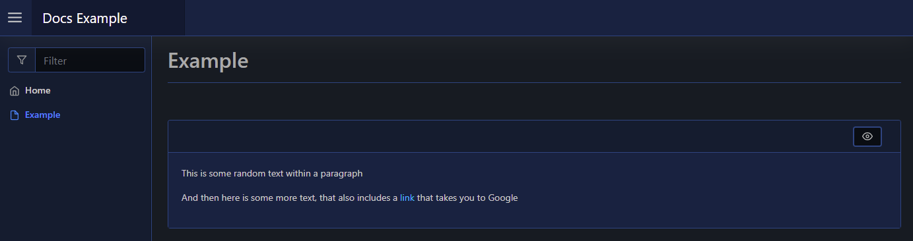

# Paragraph

| Support | |
| ------- |-|
| Events | No |

You can display a `-Value`, or other `-Content`, within a paragraph block using [`New-PodeWebParagraph`](../../../Functions/Elements/New-PodeWebParagraph). This lets you separate blocks of text/elements neatly on a page:

```powershell
New-PodeWebCard -Content @(
    New-PodeWebParagraph -Value 'This is some random text within a paragraph'
    New-PodeWebParagraph -Content @(
        New-PodeWebText -Value 'And then here is some more text, that also includes a '
        New-PodeWebLink -Value 'link' -Source 'https://google.com'
        New-PodeWebText -Value ' that takes you to Google'
    )
)
```

Which looks like below:


