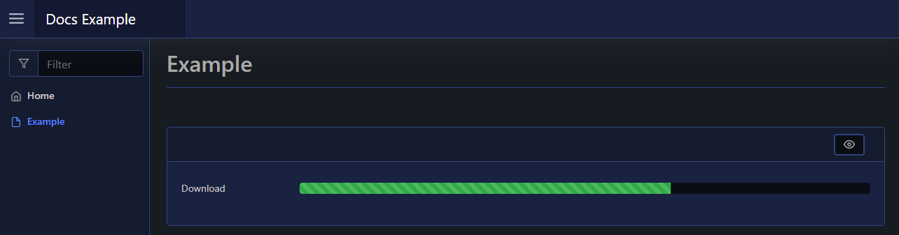

# Progress Bar

You can show a progress bar on your page via [`New-PodeWebProgress`](../../../Functions/Elements/New-PodeWebProgress). The default min/max values are 0-100, but can be changed via `-Min` and `-Max`. You can specify the current value via `-Value`, and alter the `-Colour`. You can also make the progress bar `-Striped` and/or `-Animated` (only really works with a striped progress bar!):

```powershell
New-PodeWebCard -Content @(
    New-PodeWebProgress -Name 'Download' -Value 65 -Colour Green -Striped -Animated
)
```

Which looks like below:


