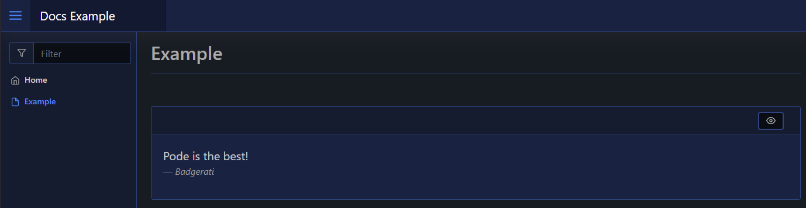

# Quote

| Support | |
| ------- |-|
| Events | No |

You can render a quote to your page by using [`New-PodeWebQuote`](../../../Functions/Elements/New-PodeWebQuote). This will show a quoted message (`-Value`), with optional `-Source`, to your page:

```powershell
New-PodeWebCard -Content @(
    New-PodeWebQuote -Value 'Pode is the best!' -Source 'Badgerati'
)
```

Which looks like below:


