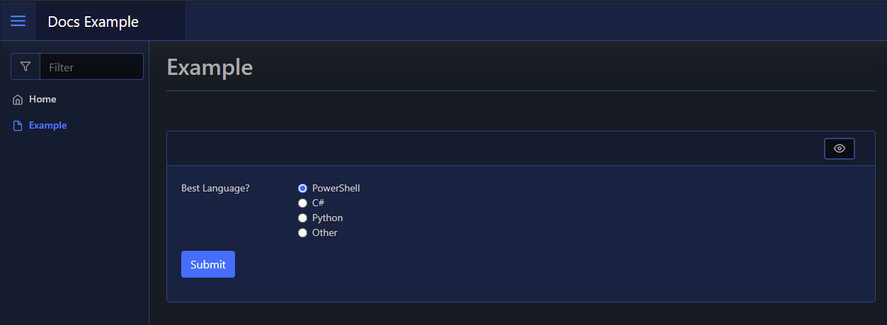

# Radio

| Support | |
| ------- |-|
| Events | Yes |

The Radio element is a form input element, and can be added using [`New-PodeWebRadio`](../../../Functions/Elements/New-PodeWebRadio). This will add a series of radio buttons to your form:

```powershell
New-PodeWebCard -Content @(
    New-PodeWebForm -Name 'Example' -ScriptBlock {
        $bestLang = $WebEvent.Data['Best Language?']
    } -Content @(
        New-PodeWebRadio -Name 'Best Language?' -Options 'PowerShell', 'C#', 'Python', 'Other'
    )
)
```

Which looks like below:



## Display Name

By default the label displays the `-Name` of the element. You can change the value displayed by also supplying an optional `-DisplayName` value; this value is purely visual, when the user submits the form the value of the element is still retrieved using the `-Name` from `$WebEvent.Data`.

## Display Options

By default the options displayed are from the `-Options` parameter. Like the Name, you can change the values displayed by supplying the optional `-DisplayOptions` - values in the array should be in the same order as the values in `-Options`. These values are, like the Display Name, purely visual, and when the form is submitted the server receives the original values from `-Options`.
