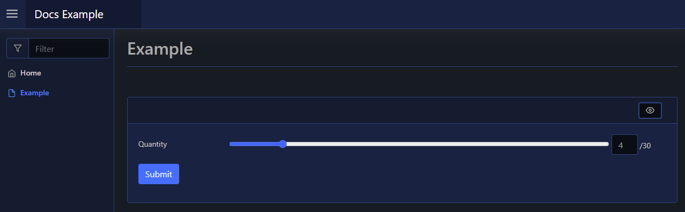

# Range

| Support | |
| ------- |-|
| Events | Yes |

The Range element is a form input element, and can be added using [`New-PodeWebRange`](../../../Functions/Elements/New-PodeWebRange). This will add a range slider to your form, with default min/max values of 0-100, but these can be altered via `-Min` and `-Max`. You can set a default `-Value`, and show the currently selected value via `-ShowValue`:

```powershell
New-PodeWebCard -Content @(
    New-PodeWebForm -Name 'Example' -ScriptBlock {
        $quantity = $WebEvent.Data['Quantity']
    } -Content @(
        New-PodeWebRange -Name 'Quantity' -Max 30 -Value 1 -ShowValue
    )
)
```

Which looks like below:



## Display Name

By default the label displays the `-Name` of the element. You can change the value displayed by also supplying an optional `-DisplayName` value; this value is purely visual, when the user submits the form the value of the element is still retrieved using the `-Name` from `$WebEvent.Data`.
