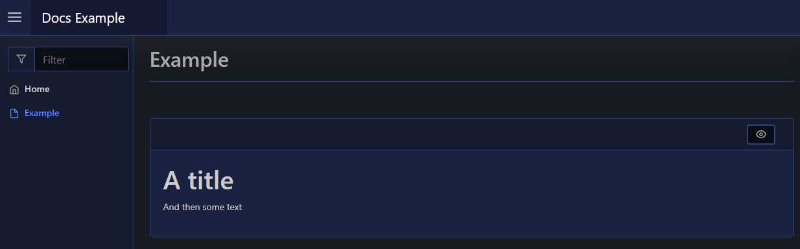

# Raw

This will render raw HTML to your page, using [`New-PodeWebRaw`](../../../Functions/Elements/New-PodeWebRaw):

```powershell
New-PodeWebCard -Content @(
    New-PodeWebRaw -Value '<h1>A title</h1><p>And then some text</p>'
)
```

Which looks like below:


