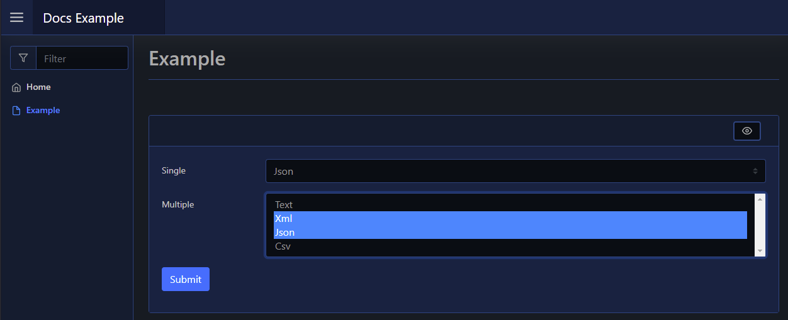

# Select

The Select element is a form input element, and can be added using [`New-PodeWebSelect`](../../../Functions/Elements/New-PodeWebSelect). This will add a dropdown select menu to your form, allowing the user to select an entry; to allow multiple entries to be selected you can pass `-Multiple`, and to specify a pre-selected value you can use `-SelectedValue`:

```powershell
New-PodeWebCard -Content @(
    New-PodeWebForm -Name 'Example' -ScriptBlock {
        $single = $WebEvent.Data['Single']
        $multiple = $WebEvent.Data['Multiple']
    } -Content @(
        New-PodeWebSelect -Name 'Single' -Options 'Text', 'Xml', 'Json', 'Csv' -SelectedValue 'Json'
        New-PodeWebSelect -Name 'Multiple' -Options 'Text', 'Xml', 'Json', 'Csv' -Multiple
    )
)
```

!!! Note
    When using `-Multiple`, the values will be sent back in a comma separated list

Which looks like below:



You can hide the "Choose an Option" option by passing `-NoChooseOption`, or you can change it value via `-ChooseOptionValue`.
