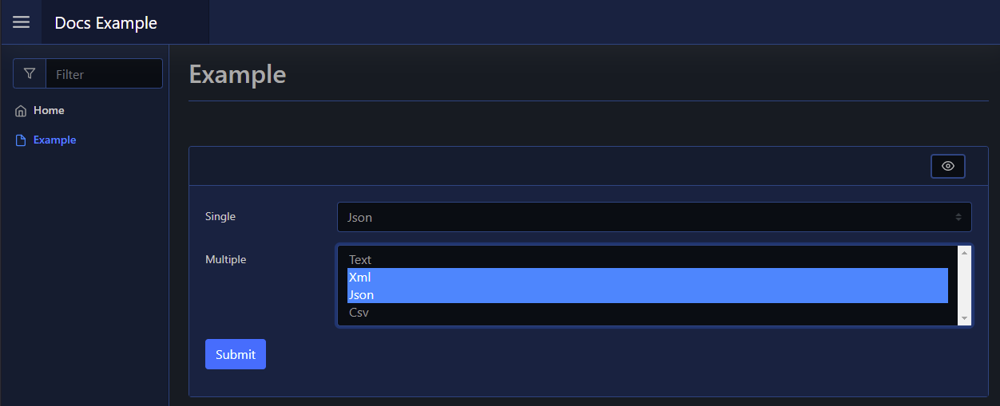

# Select

| Support |     |
| ------- | --- |
| Events  | Yes |

The Select element is a form input element, and can be added using [`New-PodeWebSelect`](../../../Functions/Elements/New-PodeWebSelect). This will add a dropdown select menu to your form/page, allowing the user to select an entry - or multiple entries by passing `-Multiple`.

## Options

To create a Select element with pre-defined options, you can use the `-Options` parameter which accepts an array of either [`New-PodeWebOption`](../../../Functions/Elements/New-PodeWebOption) and/or [`New-PodeWebOptionGroup`](../../../Functions/Elements/New-PodeWebOptionGroup):

```powershell
New-PodeWebCard -Content @(
    New-PodeWebForm -Name 'Example' -ScriptBlock {
        $single = $WebEvent.Data['SingleExample']
        $multiple = $WebEvent.Data['MultipleExample']
    } -Content @(
        New-PodeWebSelect -Name 'SingleExample' -Options @(
            New-PodeWebOption -Name 'Text'
            New-PodeWebOption -Name 'Xml'
            New-PodeWebOption -Name 'Json' -Selected
            New-PodeWebOption -Name 'Csv'
        )

        New-PodeWebSelect -Name 'MultipleExample' -Multiple -Options @(
            New-PodeWebOptionGroup -Name 'Types' -Options (
                New-PodeWebOption -Name 'Text'
                New-PodeWebOption -Name 'Xml'
                New-PodeWebOption -Name 'Json'
                New-PodeWebOption -Name 'Csv'
            )
        )
    )
)
```

!!! Note
    When using `-Multiple`, the selected values will be sent back to the server as a comma-separated list

Which looks like below:



### Dynamic

You can build a Select element's options dynamically by using the `-ScriptBlock` parameter. This will allow you to retrieve the options from elsewhere for use with the Select element.

You can either return an array of raw values, or pipe the options into, and return, [`Update-PodeWebSelect`](../../../Functions/Actions/Update-PodeWebSelect). When using the latter you will need to supply the options as Option elements, for this you can either build the options using [`New-PodeWebOption`](../../../Functions/Elements/New-PodeWebOption) or convert raw values via [`ConvertTo-PodeWebOption`](../../../Functions/Elements/ConvertTo-PodeWebOption).

The following will both build a Select element with 10 random numbers as the options, using the above methods:

```powershell
New-PodeWebCard -Content @(
    New-PodeWebForm -Name 'Example' -ScriptBlock {
        # return raw values for Pode.Web to convert
        New-PodeWebSelect -Name 'RawValues' -ScriptBlock {
            foreach ($i in (1..10)) {
                Get-Random -Minimum 1 -Maximum 10
            }
        }

        # use New-PodeWebOption
        New-PodeWebSelect -Name 'NewToUpdate' -ScriptBlock {
            $options = @(foreach ($i in (1..10)) {
                New-PodeWebOption -Name (Get-Random -Minimum 1 -Maximum 10)
            })

            $options | Update-PodeWebSelect -Id $ElementData.Id
        }

        # use ConvertTo-PodeWebOption
        New-PodeWebSelect -Name 'NewToUpdate' -ScriptBlock {
            $options = @(foreach ($i in (1..10)) {
                Get-Random -Minimum 1 -Maximum 10
            })

            $options |
                ConvertTo-PodeWebOption |
                Update-PodeWebSelect -Id $ElementData.Id
        }
    }
)
```

## Multiple

You can render a multiple select element, where more than one option can be selected, by using the `-Multiple` switch. By default only the first 4 options are shown, this can be altered using the `-Size` parameter.

## Display Name

By default the label displays the `-Name` of the element. You can change the value displayed by also supplying an optional `-DisplayName` value; this value is purely visual, when the user submits the form the value of the element is still retrieved using the `-Name` from `$WebEvent.Data`.
