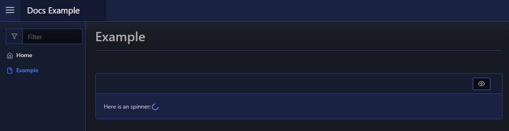

# Spinner

The spinner element will render a progress spinner to your page. To create a spinner element you use [`New-PodeWebSpinner`](../../../Functions/Elements/New-PodeWebSpinner), you can also change the spinner colour via `-Colour` which can be a known name (red/green/etc) or a hex value (#333333).

```powershell
New-PodeWebCard -Content @(
    New-PodeWebText -Value 'Here is an spinner: '
    New-PodeWebSpinner -Colour 'cornflowerblue'
)
```

Which looks like below:


