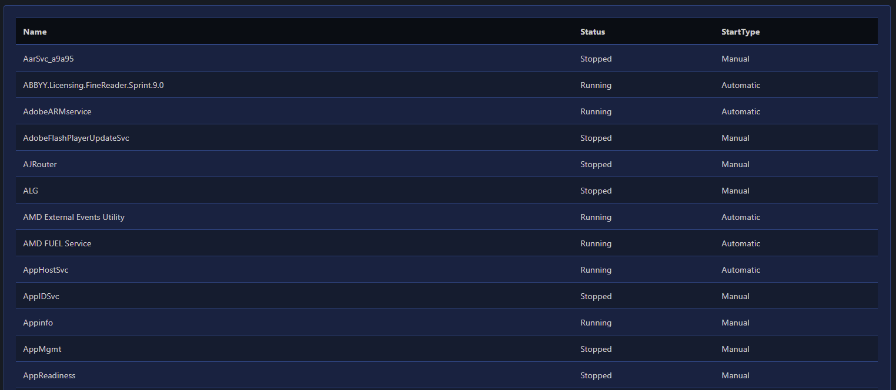
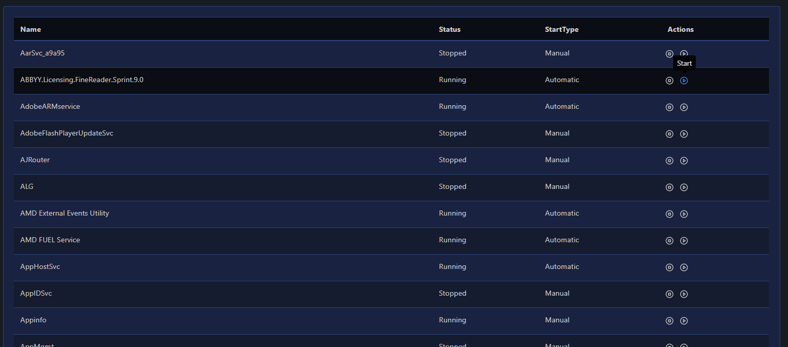
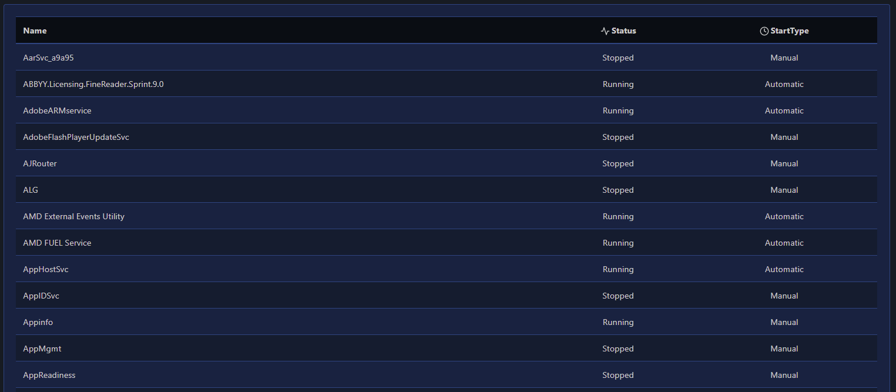

# Table

You can display data rendered in a table by using [`New-PodeWebTable`](../../../Functions/Elements/New-PodeWebTable), and you can also render certain other elements within a table such as:

* Buttons
* Badges
* Spinners
* Icons
* Links

A table gets its data from a supplied `-ScriptBlock`, more information below, and you can also `-AutoRefresh` a table, to fetch new data every minute. Tables also support being sorted, paginated, clickable and filtered.

## Data

To supply data to be rendered in a table, you have to supply a `-ScritpBlock` which returns the appropriate data in the correct format. You can also supply other elements to be rendered within the table, within the data that's returned.

### Raw

The data format to be returned from a table's `-ScriptBlock` is simple, it's purely just Key:Value in an ordered hashtable/pscustomobject:

The following example renders a table for services on a computer, displaying the Name, Status and StartTypes of the services:

```powershell
New-PodeWebContainer -Content @(
    New-PodeWebTable -Name 'Services' -ScriptBlock {
        foreach ($svc in (Get-Service)) {
            [ordered]@{
                Name      = $svc.Name
                Status    = "$($svc.Status)"
                StartType = "$($svc.StartType)"
            }
        }
    }
)
```

which renders a table that looks like below:



### Elements

Extending on the raw example above, you can also render certain elements within a table. Let's say you want two buttons in the table, one to start the service, and one to stop the service; to do this, we just have to use [`New-PodeWebButton`](../../../Functions/Elements/New-PodeWebButton) within the returned data hashtable. So that the button's scriptblock knows which services we which to stop/start, we'll need to supply `-DataColumn Name` to the table. When a button within the table is clicked, the value of the column in that button's row will be available via `$WebEvent.Data.Value` in the button's scriptblock.

```powershell
New-PodeWebContainer -Content @(
    New-PodeWebTable -Name 'Services' -DataColumn Name -ScriptBlock {
        foreach ($svc in (Get-Service)) {
            [ordered]@{
                Name      = $svc.Name
                Status    = "$($svc.Status)"
                StartType = "$($svc.StartType)"
                Actions   = @(
                    New-PodeWebButton -Name 'Stop' -Icon 'Stop-Circle' -IconOnly -ScriptBlock {
                        Stop-Service -Name $WebEvent.Data.Value -Force | Out-Null
                        Show-PodeWebToast -Message "$($WebEvent.Data.Value) stopped"
                        Sync-PodeWebTable -Id $ElementData.Parent.ID
                    }
                    New-PodeWebButton -Name 'Start' -Icon 'Play-Circle' -IconOnly -ScriptBlock {
                        Start-Service -Name $WebEvent.Data.Value -Force | Out-Null
                        Show-PodeWebToast -Message "$($WebEvent.Data.Value) started"
                        Sync-PodeWebTable -Id $ElementData.Parent.ID
                    }
                )
            }
        }
    }
)
```

which renders a table that looks like below:



### CSV

There's also the option to render a table straight from a CSV file. If you supply the path to a CSV file via `-CsvFilePath`, then the table will be built using that file:

```powershell
New-PodeWebTable -Name 'Users' -DataColumn UserId -CsvFilePath './users.csv' -AsCard
```

## Options

### Click

You can set the table rows to be clickable by passing `-Click`. This by default will set it so when a row is clicked, the page is reloaded, and the `-DataColumn` value for that row will be set in the query string as `?value=<value>` - available in `$WebEvent.Query.Value`.

You can set a dynamic click action by supplying a `-ClickScriptBlock`. Now when a row is clicked, the scriptblock is called, and the `-DataColumn` value will now be available via `$WebEvent.Data.Value`. In the scriptblock, you can use the normal output actions.

### Filter

You can set the table rows to be filterable by passing `-Filter`. When set, a textbox will be available above the table, and only rows containing the textbox's value will be displayed.

### Paginate

You can set a table to support paging by passing `-Paginate`. This will auto-paginate the table data into pages of 20 items, which can also be configured via `-PageAmount`.

### Sort

You can set the table rows to be sortable by passing `-Sort`. When set, clicking the table's headers will sort the table by that column.

## Columns

You can set how certain columns in a table behave, such as: width, alignment, display name, and header icon. You can do this via [`Initialize-PodeWebTableColumn`](../../../Functions/Elements/Initialize-PodeWebTableColumn), and by passing these columns into `-Columns` of [`New-PodeWebTable`](../../../Functions/Elements/New-PodeWebTable).

For example, using the services examples above, you can centrally align the Status/StartType columns and give them icons:

```powershell
New-PodeWebContainer -Content @(
    New-PodeWebTable -Name 'Services' -ScriptBlock {
        foreach ($svc in (Get-Service)) {
            [ordered]@{
                Name      = $svc.Name
                Status    = "$($svc.Status)"
                StartType = "$($svc.StartType)"
            }
        }
    } `
    -Columns @(
        Initialize-PodeWebTableColumn -Key Status -Alignment Center -Icon Activity
        Initialize-PodeWebTableColumn -Key StartType -Alignment Center -Icon Clock
    )
)
```

which renders a table that looks like below:



## Buttons

At the bottom of a table, there are usually two buttons on the left: Refresh and Export. You can add more buttons to a table by piping a new table into [`Add-PodeWebTableButton`](../../../Functions/Elements/Add-PodeWebTableButton):

```powershell
$table = New-PodeWebTable -Name 'Services' -ScriptBlock {
    foreach ($svc in (Get-Service)) {
        [ordered]@{
            Name      = $svc.Name
            Status    = "$($svc.Status)"
            StartType = "$($svc.StartType)"
        }
    }
}

$table | Add-PodeWebTableButton -Name 'Excel' -Icon Database -ScriptBlock {
    $WebEvent.Data | Export-Csv -Path $path -NoTypeInformation
}

New-PodeWebContainer -Content $table
```
