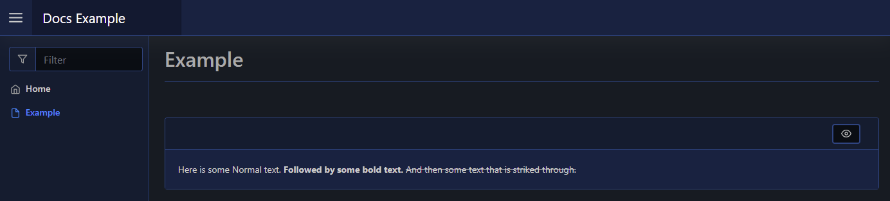

# Text

| Support | |
| ------- |-|
| Events | No |

You can render different types of text/typography to your page by using [`New-PodeWebText`](../../../Functions/Elements/New-PodeWebText). You can specify the `-Value` to display, and then a custom `-Style` to render the text; such as Normal, Bold, Italic, etc. (default is Normal):

```powershell
New-PodeWebCard -Content @(
    New-PodeWebText -Value 'Here is some Normal text.'
    New-PodeWebText -Value 'Followed by some bold text.' -Style Bold
    New-PodeWebText -Value 'And then some text that is striked through.' -Style StrikeThrough
)
```

Which looks like below:



## Pronunciation

You can add small pronunciation text above displayed text by using `-Pronunciation`:

```powershell
New-PodeWebText -Value '漢' -Pronunciation 'ㄏㄢˋ'
```

(Note: for the above to render properly, use PowerShell 6+)
