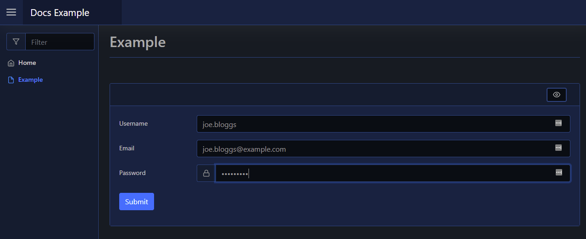
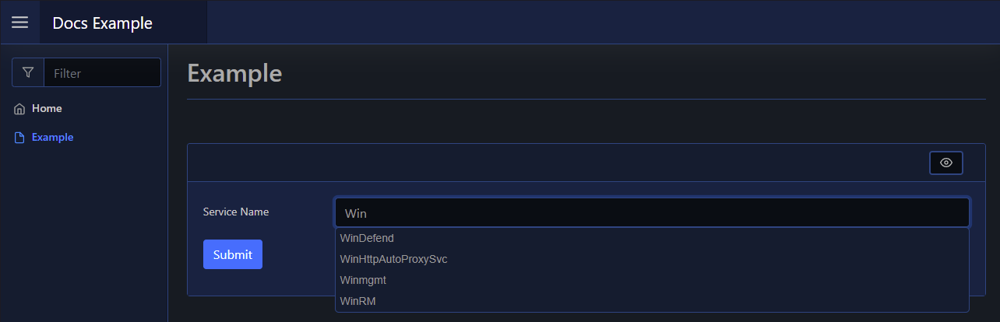
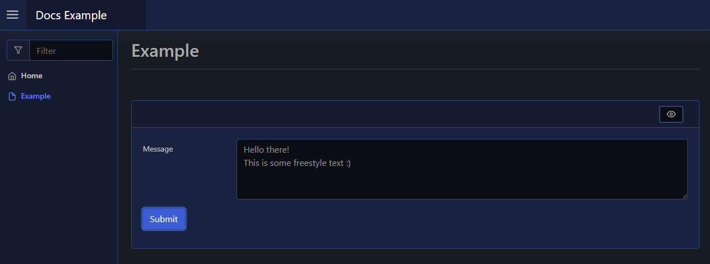

# Textbox

| Support | |
| ------- |-|
| Events | Yes |

A textbox element is a form input element; you can render a textbox, single and multiline, to your page using [`New-PodeWebTextbox`](../../../Functions/Elements/New-PodeWebTextbox).

A textbox by default is a normal plain single lined textbox, however you can customise its `-Type` to Email/Password/etc. To change the textbox to be multilined you ca supply `-Multiline`.

Textboxes also allow you to specify `-AutoComplete` values.

## Single

A default textbox is just a simple single lined textbox. You can change the type to Email/Password/etc using the `-Type` parameter:

```powershell
New-PodeWebCard -Content @(
    New-PodeWebForm -Name 'Example' -ScriptBlock {
        $username = $WebEvent.Data['Username']
        $email = $WebEvent.Data['Email']
        $password = $WebEvent.Data['Password']
    } -Content @(
        New-PodeWebTextbox -Name 'Username'
        New-PodeWebTextbox -Name 'Email' -Type Email
        New-PodeWebTextbox -Name 'Password' -Type Password -PrependIcon Lock
    )
)
```

Which looks like below:



### AutoComplete

For a single textbox, you can supply autocomplete values via a scriptblock passed to `-AutoComplete`. This scriptblock should return an array of strings, and will be called once when the textbox is initially loaded:

```powershell
New-PodeWebCard -Content @(
    New-PodeWebForm -Name 'Example' -ScriptBlock {
        $svcName = $WebEvent.Data['Service Name']
    } -Content @(
        New-PodeWebTextbox -Name 'Service Name' -AutoComplete {
            return @(Get-Service).Name
        }
    )
)
```

Which looks like below:



## Multiline

A mutlilined textbox can be displayed by passing `-Multiline`. You cannot change the type of this textbox, it will always allow freestyle text:

```powershell
New-PodeWebCard -Content @(
    New-PodeWebForm -Name 'Example' -ScriptBlock {
        $message = $WebEvent.Data['Message']
    } -Content @(
        New-PodeWebTextbox -Name 'Message' -Multiline
    )
)
```

Which looks like below:



By default it shows the first 4 lines of text, this can be altered using the `-Size` parameter.

## Inline

You can render this element inline with other non-form elements by using the `-NoForm` switch. This will remove the form layout, and render the element more cleanly when used outside of a form.

## Display Name

By default the label displays the `-Name` of the element. You can change the value displayed by also supplying an optional `-DisplayName` value; this value is purely visual, when the user submits the form the value of the element is still retrieved using the `-Name` from `$WebEvent.Data`.

## Size

The `-Width` of a textbox has the default unit of `%`. If `0` is specified then `auto` is used instead. Any custom value such as `100px` can be used, but if a plain number is used then `%` is appended.

The `-Height` of the textbox is how many lines are displayed when the textbox is multilined.

## Max Length

The `-MaxLength` parameter limits how many characters a user is allowed to enter into the text box.

When parameter is not specified, the default value is 524288. The minimum allowed value is 0.
