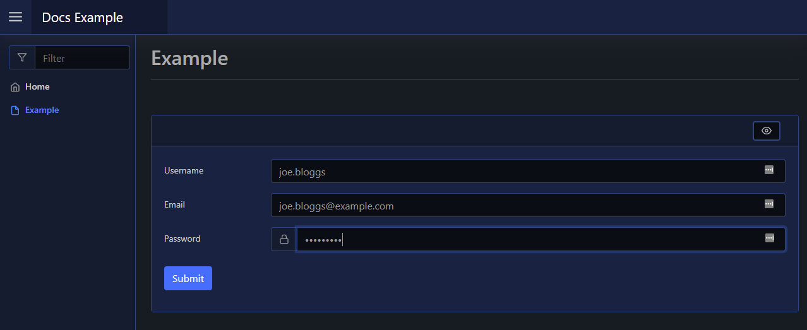
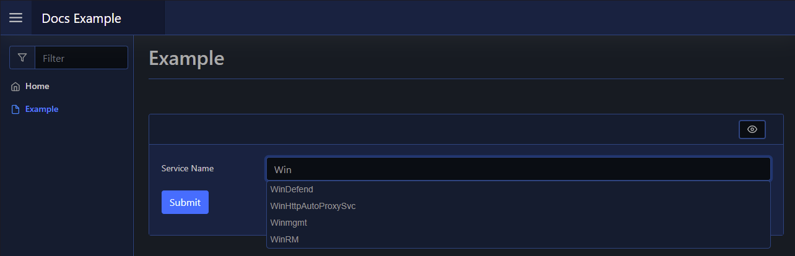
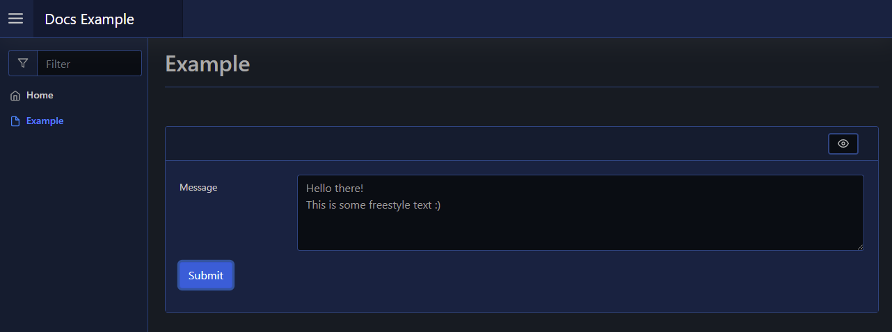

# Textbox

| Support |     |
| ------- | --- |
| Events  | Yes |

A Textbox element is a form input element; you can render a Textbox, single and multiline, to your page using [`New-PodeWebTextbox`](../../../Functions/Elements/New-PodeWebTextbox).

A Textbox by default is a normal single lined textbox, however you can customise its `-Type` to Email/Password/etc. To change the textbox to be a multiline textbox you can supply the `-Multiline` switch.

Supported types are:
* Text
* Email
* Password
* Number
* Date
* Time
* File
* DateTime

Textboxes also allow you to specify `-AutoComplete` options, as ([described here](#autocomplete)).

## Single

A default Textbox is just a simple single lined textbox. You can change the type to Email/Password/etc using the `-Type` parameter:

```powershell
New-PodeWebCard -Content @(
    New-PodeWebForm -Name 'Example' -ScriptBlock {
        $username = $WebEvent.Data['Username']
        $email = $WebEvent.Data['Email']
        $password = $WebEvent.Data['Password']
    } -Content @(
        New-PodeWebTextbox -Name 'Username'
        New-PodeWebTextbox -Name 'Email' -Type Email
        New-PodeWebTextbox -Name 'Password' -Type Password -PrependIcon Lock
    )
)
```

Which looks like below:



### AutoComplete

For a single Textbox, you can supply autocomplete options via a scriptblock passed to `-AutoComplete`. This scriptblock should return an array of strings, and will be called once when the textbox is initially loaded:

```powershell
New-PodeWebCard -Content @(
    New-PodeWebForm -Name 'Example' -ScriptBlock {
        $svcName = $WebEvent.Data['Service Name']
    } -Content @(
        New-PodeWebTextbox -Name 'Service Name' -AutoComplete {
            return @(Get-Service).Name
        }
    )
)
```

Which looks like below:



#### Delay

You can delay when the autocomplete options are shown by supplying `-AutoCompleteMinLength`. By default this is `1`, and the value refers to the number of characters typed into the Textbox before the option are displayed.

!!! note
    The options will still be loaded on initial page load, but will not render until the specified number of characters.

#### Dynamic

To have the autocomplete scriptblock be invoked on every character, instead of once on page load, you supply `-AutoCompleteType Always`. The default is `Once`, and `Always` will invoke the scriptblock every time.

To help with dynamic filtering, the current value entered into the Textbox is supplied as `$WebEvent.Data.Value` - this is only available when using the `Always` autocomplete type, and **not** in the default `Once` type.

```powershell
New-PodeWebCard -Content @(
    New-PodeWebForm -Name 'Example' -ScriptBlock {
        $svcName = $WebEvent.Data['Service Name']
    } -Content @(
        New-PodeWebTextbox -Name 'Service Name' -AutoCompleteType Always -AutoComplete {
            return Get-Service |
                Where-Object { $_.Name -ilike "*$($WebEvent.Data.Value)*" } |
                Select-Object -ExpandProperty Name
        }
    )
)
```

!!! tip
    The `-AutoCompleteMinLength` parameter still work here, and the scriptblock will only be invoked after the specified number of characters.

## Multiline

A multi-lined Textbox can be displayed by passing `-Multiline`. You cannot change the type of this Textbox as only `Text` types support multi-line:

```powershell
New-PodeWebCard -Content @(
    New-PodeWebForm -Name 'Example' -ScriptBlock {
        $message = $WebEvent.Data['Message']
    } -Content @(
        New-PodeWebTextbox -Name 'Message' -Multiline
    )
)
```

Which looks like below:



By default it shows the first 4 lines of text, this can be altered using the `-Size` parameter.

## Display Name

By default the label displays the `-Name` of the element. You can change the value displayed by also supplying an optional `-DisplayName` value; this value is purely visual, when the user submits the form the value of the element is still retrieved using the `-Name` from `$WebEvent.Data`.

## Size

The `-Width` of a textbox has the default unit of `%`. If `0` is specified then `auto` is used instead. Any custom value such as `100px` can be used, but if a plain number is used then `%` is appended.

The `-Height` of the textbox is how many lines are displayed when the textbox is multiline.

## Initial Value

You can create the Textbox with an initial value by using the `-Value` parameter. When using this parameter for a Textbox of type Date or Time the formats should be as follows:

* Date: `-Value 'yyyy-mm-dd'`
* Time: `-Value 'hh:mm'`
