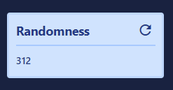
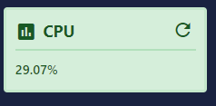
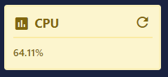
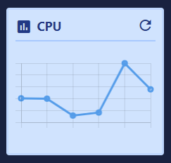

# Tile

| Support | |
| ------- |-|
| Events | No |

A tile is a small coloured container, that contains either a static value or more elements. There purpose is to display quick informational data like: CPU, counters, charts, etc.

To add a tile you use [`New-PodeWebTile`](../../../Functions/Elements/New-PodeWebTile), and supply a `-Name` and either a `-ScriptBlock` or `-Content`.

## Value

The simplest tile is one that shows a flat value. This value should be returned from a `-ScriptBlock`, for example to show an random number:

```powershell
New-PodeWebCard -Content @(
    New-PodeWebTile -Name 'Randomness' -ScriptBlock {
        return (Get-Random -Minimum 0 -Maximum 1000)
    }
)
```

Which looks like below:



> If you click the refresh icon, the scriptblock will be re-called, and the value updated.

Or, if you want to display the current CPU but change the colour if it goes above 50%, then you can use [`Update-PodeWebTile`](../../../Functions/Actions/Update-PodeWebTile) instead:

```powershell
New-PodeWebCard -Content @(
    New-PodeWebTile -Name 'CPU' -Icon 'chart-box' -ScriptBlock {
        $cpu = ((Get-Counter -Counter '\Processor(_Total)\% Processor Time' -SampleInterval 1 -MaxSamples 2).CounterSamples.CookedValue | Measure-Object -Average).Average

        $colour = 'green'
        if ($cpu -gt 90) {
            $colour = 'red'
        }
        elseif ($cpu -gt 50) {
            $colour = 'yellow'
        }

        $cpu = [System.Math]::Round($cpu, 2)
        "$($cpu)%" | Update-PodeWebTile -ID $ElementData.ID -Colour $colour
    }
)
```

Which looks like below:




You can pass values to the scriptblock by using the `-ArgumentList` parameter. This accepts an array of values/objects, and they are supplied as parameters to the scriptblock:

```powershell
New-PodeWebTile -Name 'Example' -ArgumentList 'Value1', 2, $false -ScriptBlock {
    param($value1, $value2, $value3)

    # $value1 = 'Value1'
    # $value2 = 2
    # $value3 = $false
}
```

## Elements

You can also display other elements within a tile, such as a chart. To display elements, add them via the `-Content` parameter.

For example, the following will display a tile showing the current CPU of your machine, and will auto-refresh every minute:

```powershell
New-PodeWebCard -Content @(
    New-PodeWebTile -Name 'CPU' -Icon 'chart-box' -Content @(
        New-PodeWebCounterChart -Counter '\Processor(_Total)\% Processor Time' -MaxItems 10
    )
)
```

Which looks like below:



## Clickable

You can make a whole tile clickable by supplying a `-ClickScriptBlock`. When clicked the scriptblock will be called, and you can use any action within the scriptblock.

For example, the following will show a tile with a random number, but when clicked it will display a toast message:

```powershell
New-PodeWebCard -Content @(
    New-PodeWebTile -Name 'Randomness' -ScriptBlock {
        return (Get-Random -Minimum 0 -Maximum 1000)
    } `
    -ClickScriptBlock {
        Show-PodeWebToast -Message 'A toast message!'
    }
)
```

## Refresh

By default, all tiles will show a "refresh" icon at the top-right corner, and when clicked the tile's data will be refreshed. You can hide the refresh icon by using `-NoRefresh`.

To set a tile to automatically refresh once a minute, you can supply the `-AutoRefresh` switch.

## Display

Tiles will be displayed inline, and to display one on a new line you can supply the `-NewLine` switch.

If you want to display the tiles more neatly in a line, it's recommended to display them using a [Grid](../../Layouts/Grid).
