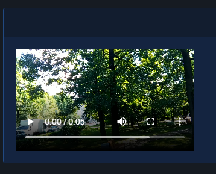

# Video

| Support | |
| ------- |-|
| Events | Yes |

To play video clips on your site you can use [`New-PodeWebVideo`](../../../Functions/Elements/New-PodeWebVideo). The video can be set to auto-play and loop, and can also accept multiple sources and tracks.

The sources specified can be done so via `-Source` and [`New-PodeWebVideoSource`](../../../Functions/Elements/New-PodeWebVideoSource). Sources can only be of type `MP4`, `OGG` and `WebM`, and at least one source must be specified. An optional thumbnail Url can also be supplied, and this will be the image used for the video before it is played:

```powershell
New-PodeWebCard -Content @(
    New-PodeWebVideo -Name 'example' -Thumbnail 'https://samplelib.com/lib/preview/mp4/sample-5s.jpg' -Source @(
        New-PodeWebVideoSource -Url 'https://samplelib.com/lib/preview/mp4/sample-5s.mp4'
    )
)
```

Which looks like below:



Any optional tracks you wish to specify can be done via `-Track` and [`New-PodeWebMediaTrack`](../../../Functions/Elements/New-PodeWebMediaTrack). Tracks can only be of type `VTT`, and can be used for subtitles, captions, metadata, etc.

The `-Language` is mandatory if the track's `-Type` is subtitles, and should be a [2-letter language code](https://www.w3schools.com/tags/ref_language_codes.asp).

```powershell
New-PodeWebCard -Content @(
    New-PodeWebVideo -Name 'example' -Thumbnail 'https://samplelib.com/lib/preview/mp4/sample-5s.jpg' -Source @(
        New-PodeWebVideoSource -Url 'https://samplelib.com/lib/preview/mp4/sample-5s.mp4'
    ) `
    -Tracks @(
        New-PodeWebMediaSource -Url '/some/url/path/english.vtt' -Language 'en' -Title 'English' -Type 'subtitles' -Default
    )
)
```

## Size

The `-Width` and `-Height` of a video have the default unit of `%`. If `0` is specified then `20%` is used for the width, and `15%` for the height instead. Any custom value such as `100px` can be used, but if a plain number is used then `%` is appended.

## Events

The following specific events are supported by the Video element, and can be registered via [`Register-PodeWebMediaEvent`](../../../Functions/Events/Register-PodeWebMediaEvent):

| Name | Description |
| ---- | ----------- |
| CanPlay | Fires when the browser is ready to play the video |
| Ended | Fires when the video has finished playing, unless looping |
| Pause | Fires when the video is paused |
| Play | Fires when the video is played, or un-paused |

Example:

```powershell
New-PodeWebVideo -Name 'example' -Thumbnail 'https://samplelib.com/lib/preview/mp4/sample-5s.jpg' -Source @(
        New-PodeWebVideoSource -Url 'https://samplelib.com/lib/preview/mp4/sample-5s.mp4'
    ) |
Register-PodeWebMediaEvent -Type Play -ScriptBlock {
    Show-PodeWebToast -Title 'Action' -Message $EventType
}
```

## Public Content

The `-Thumbnail` parameter path for a video from `New-PodeWebVideo` typically references media stored in a `public` folder in your project root. If your file system is case sensitive (default on Linux, but not on Windows), then the `public` folder in your project root MUST be all lower case. More details [available in Pode documentation](https://badgerati.github.io/Pode/Tutorials/Routes/Utilities/StaticContent/#public-directory).

This same behavior is also found in the `-Url` parameter for both `New-PodeWebVideoSource` and `New-PodeWebMediaSource`.
