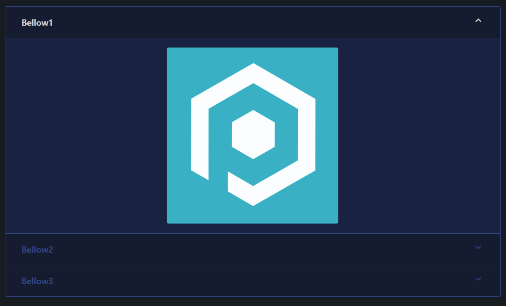

# Accordion

An accordion layout is an array of accordion bellows with content. They are displayed in a collapsible manor, with the first bellow being expanded. When another bellow is expanded, all other bellows are collapsed.

The bellows take an array of components via `-Content`, that can be either other layouts or raw elements.

## Usage

To create an accordion layout you use [`New-PodeWebAccordion`](../../../Functions/Layouts/New-PodeWebAccordion), and supply it an array of `-Bellows` using [`New-PodeWebBellow`](../../../Functions/Layouts/New-PodeWebBellow). The bellows themselves accept an array of other elements/layouts as `-Content`.

For example, the following renders an accordion with 3 bellows each containing an image:

```powershell
New-PodeWebAccordion -Bellows @(
    New-PodeWebBellow -Name Bellow1 -Content @(
        New-PodeWebImage -Source '/pode.web/images/icon.png' -Alignment Center
    )
    New-PodeWebBellow -Name Bellow2 -Content @(
        New-PodeWebImage -Source '/pode.web/images/icon.png' -Alignment Center
    )
    New-PodeWebBellow -Name Bellow3 -Content @(
        New-PodeWebImage -Source '/pode.web/images/icon.png' -Alignment Center
    )
)
```

Which would look like below:



## Cycling

You can render accordions that automatically cycle through their bellows every X seconds, by using the `-Cycle` switch and `-CycleInterval` parameter. The default interval is every 15secs:

```powershell
New-PodeWebAccordion -Cycle -Bellows @(
    New-PodeWebBellow -Name Bellow1 -Content @(
        New-PodeWebImage -Source '/pode.web/images/icon.png' -Alignment Center
    )
    New-PodeWebBellow -Name Bellow2 -Content @(
        New-PodeWebImage -Source '/pode.web/images/icon.png' -Alignment Center
    )
    New-PodeWebBellow -Name Bellow3 -Content @(
        New-PodeWebImage -Source '/pode.web/images/icon.png' -Alignment Center
    )
)
```
