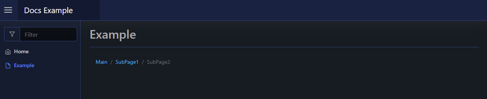

# Breadcrumbs

You can control optional breadcrumbs that appear at the top of each page using [`Set-PodeWebBreadcrumb`] and [`New-PodeWebBreadcrumbItem`]. By default, pages will show breadcrumbs if the appropriate query string parameters are set (`base` and `value`).

Or, you can control the breadcrumbs yourself, by creating breadcrumb items and then setting them on the page. Only one item can be active, and each item can have a URL that clicking the item takes it back to:

```powershell
Set-PodeWebBreadcrumb -Items @(
    New-PodeWebBreadcrumbItem -Name 'Main' -Url '/pages/PageName'
    New-PodeWebBreadcrumbItem -Name 'SubPage1' -Url '/pages/PageName?value=stuff1'
    New-PodeWebBreadcrumbItem -Name 'SubPage2' -Url '/pages/PageName?value=stuff2' -Active
)
```

Which looks like below:


