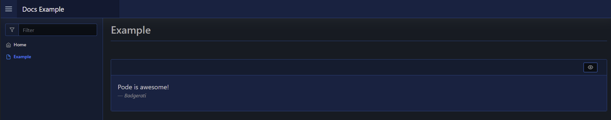
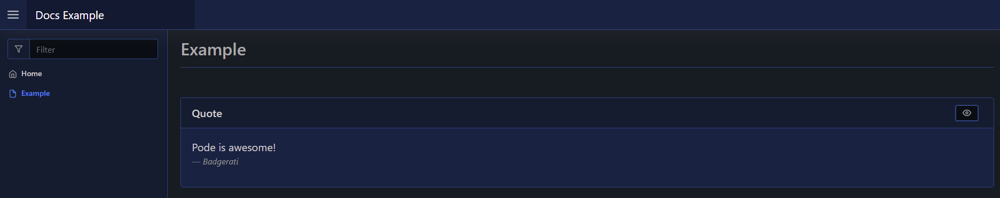

# Card

A card is a layout that renders with an optional title, and can be collapsed by the end-user.

A card takes an array of content, that can be either other layouts or raw elements.

## Usage

To create a card layout you use [`New-PodeWebCard`](../../../Functions/Layouts/New-PodeWebCard), and supply it an array of `-Content`.

For example, the below renders a card with a quote:

```powershell
New-PodeWebCard -Content @(
    New-PodeWebQuote -Value 'Pode is awesome!' -Source 'Badgerati'
)
```

Which would look like below:



Or with a title:

```powershell
New-PodeWebCard -Name 'Quote' -Content @(
    New-PodeWebQuote -Value 'Pode is awesome!' -Source 'Badgerati'
)
```

Which would look like below:


