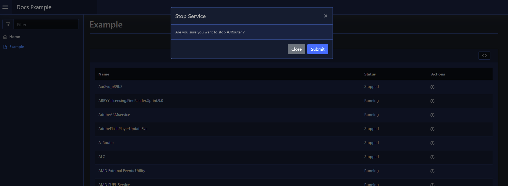
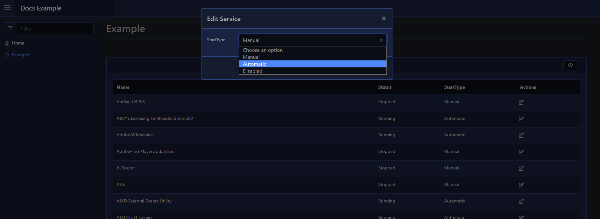

# Modal

A modal is a layout that renders on top of all other content on your web page - such as prompts to confirm information before performing an action, or a quick edit dialog.

A modal takes an array of elements via `-Content`.

## Usage

To create a modal layout you use [`New-PodeWebModal`](../../../Functions/Layouts/New-PodeWebModal), supplying a `-Name` and any `-Content`. The modal will then be on the page, but will be hidden until required. You can also supply a `-ScriptBlock` with logic to be invoked when the modal's Submit button is clicked.

To show the modal, you can use the action [`Show-PodeWebModal`](../../../Functions/Actions/Show-PodeWebModal), and supply the `-Name` of the modal to show. You can populate elements within the modal just prior to it being shown by using `-Actions`; this takes more actions to invoke such as [`Update-PodeWebCheckbox`](../../../Functions/Actions/Update-PodeWebCheckbox) and [`Update-PodeWebTextbox`](../../../Functions/Actions/Update-PodeWebTextbox), which reference elements within the modal.

On [`Show-PodeWebModal`](../../../Functions/Actions/Show-PodeWebModal) you can also supply a `-DataValue`, such as a UserId, Service Name, etc., and this value will be supplied on Submit via `$WebEvent.Data['Value']` in [`New-PodeWebModal`](../../../Functions/Layouts/New-PodeWebModal)'s scriptblock. This can be useful if showing a modal from a table using `-DataColumn`.

There's also [`Hide-PodeWebModal`](../../../Functions/Actions/Hide-PodeWebModal), which, well, hides a modal!

### Confirmation

The example below renders a table of services on the current computer. When the "stop" button/icon is clicked, the name of the service on that row (the `-DataColumn`) is passed to the button, and in-turn that supplies the service name to [`Show-PodeWebModal`](../../../Functions/Actions/Show-PodeWebModal). The modal asks if the user wants to stop the service, and on Submit it will stop the service and hide the modal:

```powershell
New-PodeWebCard -Content @(
    New-PodeWebTable -Name 'Services' -DataColumn Name -ScriptBlock {
        $stopBtn = New-PodeWebButton -Name 'Stop' -Icon 'Stop-Circle' -IconOnly -ScriptBlock {
            Show-PodeWebModal -Name 'Stop Service' -DataValue $WebEvent.Data.Value -Actions @(
                Update-PodeWebText -Id 'svc_name' -Value $WebEvent.Data.Value
            )
        }

        foreach ($svc in (Get-Service)) {
            [ordered]@{
                Name = $svc.Name
                Status = "$($svc.Status)"
                StartType = $svc.StartType
                Actions = @($stopBtn)
            }
        }
    }
)

New-PodeWebModal -Name 'Stop Service' -Content @(
    New-PodeWebText -Value 'Are you sure you want to stop '
    New-PodeWebText -Id 'svc_name'
    New-PodeWebText -Value '?'
) -ScriptBlock {
    Stop-Service -Name $WebEvent.Data.Value -Force | Out-Null
    Show-PodeWebToast -Message "$($WebEvent.Data.Value) stopped"
    Sync-PodeWebTable -Name 'Services'
    Hide-PodeWebModal
}
```

Which would look like below:



### Form Input

To use a form in your modal, you need to supply `-AsForm` to [`New-PodeWebModal`](../../../Functions/Layouts/New-PodeWebModal).

The example below again renders a table of services on the current computer. But this time there's an edit button to alter the Start-Up type of a service. When the "edit" button/icon is clicked, the name of the service on that row (the `-DataColumn`) is passed to the button, and in-turn that supplies the service name to [`Show-PodeWebModal`](../../../Functions/Actions/Show-PodeWebModal). The modal then shows a form with a select input to change the service's Start-Up type:

```powershell
New-PodeWebCard -Content @(
    New-PodeWebTable -Name 'Services' -DataColumn Name -ScriptBlock {
        $editBtn = New-PodeWebButton -Name 'Edit' -Icon 'Edit' -IconOnly -ScriptBlock {
            $svc = Get-Service -Name $WebEvent.Data.Value
            Show-PodeWebModal -Name 'Edit Service' -DataValue $WebEvent.Data.Value -Actions @(
                Set-PodeWebSelect -Name 'StartType' -Value $svc.StartType
            )
        }

        foreach ($svc in (Get-Service)) {
            [ordered]@{
                Name = $svc.Name
                Status = "$($svc.Status)"
                StartType = "$($svc.StartType)"
                Actions = @($editBtn)
            }
        }
    }
)

New-PodeWebModal -Name 'Edit Service' -AsForm -Content @(
    New-PodeWebSelect -Name 'StartType' -Options Manual, Automatic, Disabled
) -ScriptBlock {
    Get-Service -Name $WebEvent.Data.Value | Set-Service -StartType $WebEvent.Data.StartType | Out-Null
    Show-PodeWebToast -Message "$($WebEvent.Data.Value) editted"
    Sync-PodeWebTable -Name 'Services'
    Hide-PodeWebModal
}
```

Which would look like below:



#### Method/Action

The default method for forms is `Post`, and the action is the internal route created for the form.

You can change these values by using the `-Method` and `-Action` parameters. The method can only be `Get` or `Post`, and the action must be a valid URL.

### Arguments

You can pass values to the scriptblock by using the `-ArgumentList` parameter. This accepts an array of values/objects, and they are supplied as parameters to the scriptblock:

```powershell
New-PodeWebModal -Name 'Stop Service' -Content @() -ArgumentList 'Value1', 2, $false -ScriptBlock {
    param($value1, $value2, $value3)

    # $value1 = 'Value1'
    # $value2 = 2
    # $value3 = $false
}
```
