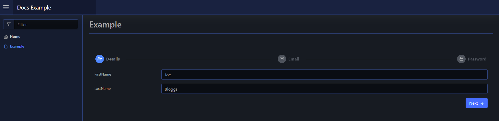

# Steps

A steps layout is an array of steps with content. You can use them to step through multiple parts of a setup process.

The steps take an array of components via `-Content`, that can be either other layouts or raw elements.

## Usage

To create a steps layout you use [`New-PodeWebSteps`](../../../Functions/Layouts/New-PodeWebSteps), and supply it an array of `-Steps` using [`New-PodeWebStep`](../../../Functions/Layouts/New-PodeWebStep). The [`New-PodeWebSteps`](../../../Functions/Layouts/New-PodeWebSteps),also takes a `-ScriptBlock`, this is the final scriptblock that is invoked after every other step's optional `-ScriptBlock`; the one where any main logic should be performed.

Each step you create via [`New-PodeWebStep`](../../../Functions/Layouts/New-PodeWebStep) has a `-Name`, `-Content`, an optional `-ScriptBlock`. This scriptblock lets you run validation, or other logic, on a per step basis. If any [`Out-PodeWebValidation`](../../../Functions/Outputs/Out-PodeWebValidation) is used, then the step will be prevented from moving forwards.

For example, the below renders a layout with 3 steps to setup a very basic user. The email/password perform validation in their steps, with the user being created in the main final scriptblock:

```powershell
New-PodeWebSteps -Name 'AddUser' -Steps @(
    New-PodeWebStep -Name 'Details' -Icon 'User-Plus' -Content @(
        New-PodeWebTextbox -Name 'FirstName'
        New-PodeWebTextbox -Name 'LastName'
    )
    New-PodeWebStep -Name 'Email' -Icon 'Mail' -Content @(
        New-PodeWebTextbox -Name 'Email'
    ) -ScriptBlock {
        if ($WebEvent.Data['Email'] -inotlike '*@*') {
            Out-PodeWebValidation -Name 'Email' -Message 'The email supplied is invalid'
        }
    }
    New-PodeWebStep -Name 'Password' -Icon 'Lock' -Content @(
        New-PodeWebTextbox -Name 'Password' -Type Password
    ) -ScriptBlock {
        if ($WebEvent.Data['Password'].Length -lt 8) {
            Out-PodeWebValidation -Name 'Password' -Message 'Password should be 8+ characters'
        }
    }
) -ScriptBlock {
    Show-PodeWebToast -Message "User created: $($WebEvent.Data['FirstName']) $($WebEvent.Data['LastName'])"
}
```

Which would look like below:




### Arguments

You can pass values to the scriptblock by using the `-ArgumentList` parameter. This accepts an array of values/objects, and they are supplied as parameters to the scriptblock:

```powershell
New-PodeWebSteps -Name 'AddUser' -Steps @() -ArgumentList 'Value1', 2, $false -ScriptBlock {
    param($value1, $value2, $value3)

    # $value1 = 'Value1'
    # $value2 = 2
    # $value3 = $false
}
```
