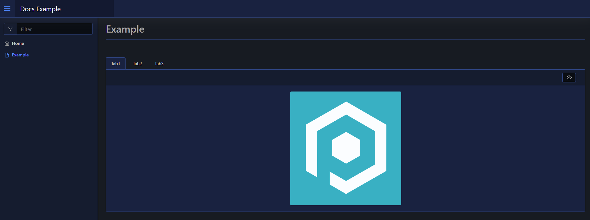

# Tabs

A tabs layout is an array of tabs with content.

The tabs take an array of layouts, that can only be other layouts and *not* raw elements.

## Usage

To create a tabs layout you use [`New-PodeWebTabs`](../../../Functions/Layouts/New-PodeWebTabs), and supply it an array of `-Tabs` using [`New-PodeWebTab`](../../../Functions/Layouts/New-PodeWebTab). The tabs themselves accept an array of other `-Content`.

For example, the below renders a layout with 3 tabs each containing an image:

```powershell
New-PodeWebTabs -Tabs @(
    New-PodeWebTab -Name Tab1 -Content @(
        New-PodeWebCard -Content @(
            New-PodeWebImage -Source '/pode.web-static/images/icon.png' -Alignment Center
        )
    )
    New-PodeWebTab -Name Tab2 -Content @(
        New-PodeWebCard -Content @(
            New-PodeWebImage -Source '/pode.web-static/images/icon.png' -Alignment Center
        )
    )
    New-PodeWebTab -Name Tab3 -Content @(
        New-PodeWebCard -Content @(
            New-PodeWebImage -Source '/pode.web-static/images/icon.png' -Alignment Center
        )
    )
)
```

Which would look like below:



## Cycling Tabs

You can render tabs that automatically cycle through themselves every X seconds, by using `-Cycle` and `-CycleInterval`. The default interval is every 15secs:

```powershell
New-PodeWebTabs -Cycle -Tabs @(
    New-PodeWebTab -Name Tab1 -Content @(
        New-PodeWebCard -Content @(
            New-PodeWebImage -Source '/pode.web-static/images/icon.png' -Alignment Center
        )
    )
    New-PodeWebTab -Name Tab2 -Content @(
        New-PodeWebCard -Content @(
            New-PodeWebImage -Source '/pode.web-static/images/icon.png' -Alignment Center
        )
    )
    New-PodeWebTab -Name Tab3 -Content @(
        New-PodeWebCard -Content @(
            New-PodeWebImage -Source '/pode.web-static/images/icon.png' -Alignment Center
        )
    )
)
```
