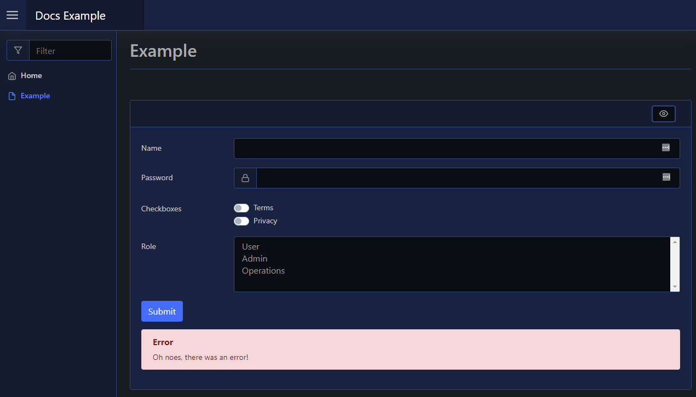

# Error

This page details the output actions available to Errors.

## Out

To create/show an error alert, such as when a form throws an unexpected error, you can use [`Out-PodeWebError`](../../../Functions/Outputs/Out-PodeWebError). This will render an error alert beneath the element/sender that triggered the action (such as a a form, or a button). These errors will automatically be removed if the form is resubmitted.

```powershell
New-PodeWebCard -Content @(
    New-PodeWebForm -Name 'Example' -ScriptBlock {
        Out-PodeWebError -Message 'Oh noes, there was an error!'
    } -Content @(
        New-PodeWebTextbox -Name 'Name'
        New-PodeWebTextbox -Name 'Password' -Type Password -PrependIcon Lock
        New-PodeWebCheckbox -Name 'Checkboxes' -Options @('Terms', 'Privacy') -AsSwitch
        New-PodeWebSelect -Name 'Role' -Options @('User', 'Admin', 'Operations') -Multiple
    )
)
```

Which would look like below:


